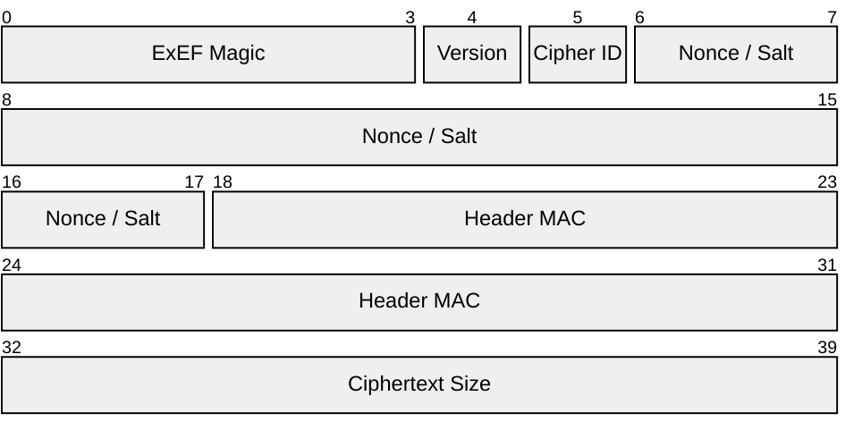

# ExEF v3 Specification

TODO: Move to Website docs

## High-Level Structure

The file is composed of three main parts: a fixed-size Header, the variable-length Ciphertext, and a fixed-size Footer.

| Part           | Size (Bytes) | Description                                      |
| :------------- | :----------- | :----------------------------------------------- |
| **Header**     | 40           | Metadata, nonce, and a MAC for key verification. |
| **Ciphertext** | Variable     | The encrypted data.                              |
| **Footer**     | 16           | The final AES-GCM authentication tag.            |

## Header Layout

All multi-byte integers are stored in **Big-Endian** format (network byte order).

| Bytes   | Field Name          | Size (Bytes) | Description                                                                                                                         |
| :------ | :------------------ | :----------- | :---------------------------------------------------------------------------------------------------------------------------------- |
| `0-3`   | **ExEF Magic**      | 4            | The ASCII string `ExEF`.                                                                                                            |
| `4`     | **Version**         | 1            | `0x03` for this version.                                                                                                            |
| `5`     | **Cipher ID**       | 1            | A 1-byte identifier for the encryption algorithm. See table below.                                                                  |
| `6-17`  | **Nonce / Salt**    | 12           | The unique 12-byte nonce for AES-GCM, also used as the salt for HKDF. **Must be unique for each file encrypted with the same key.** |
| `18-31` | **Header MAC**      | 14           | The first 14 bytes of the full HMAC-SHA256 output. Used to quickly verify the master key.                                           |
| `32-39` | **Ciphertext Size** | 8            | The length of the ciphertext data in bytes. An 8-byte unsigned integer.                                                             |

**Ciphersuite IDs:**
| ID | Algorithm | Key Size |
| :----- | :--------------- | :----------- |
| `0x01` | AES-128-GCM | 128-bit (16 bytes) |
| `0x02` | AES-192-GCM | 192-bit (24 bytes) |
| `0x03` | AES-256-GCM | 256-bit (32 bytes) |

## Ciphertext

This section immediately follows the header. Its length is defined by the `Ciphertext Size` field in the header.

## Footer

This section immediately follows the ciphertext.

| Bytes     | Field Name      | Size (Bytes) | Description                                                                |
| :-------- | :-------------- | :----------- | :------------------------------------------------------------------------- |
| `Last 16` | **AES-GCM Tag** | 16           | The 16-byte authentication tag produced by the AES-GCM encryption process. |
