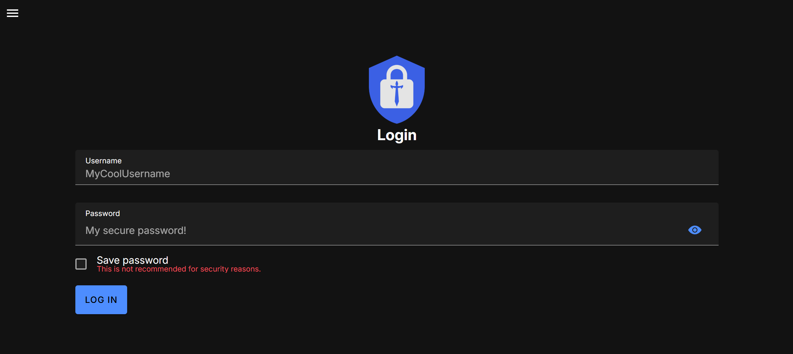
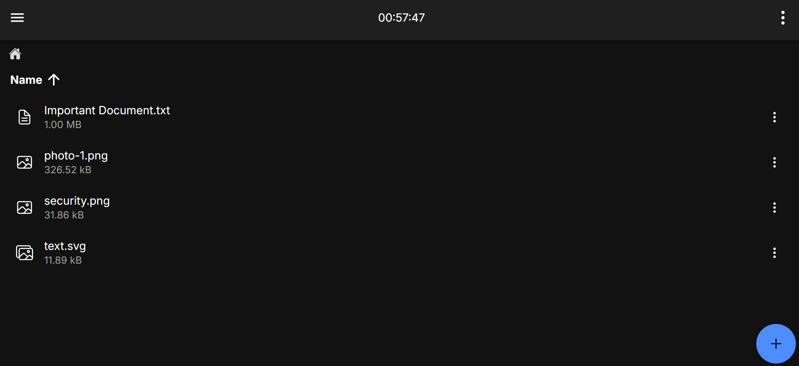
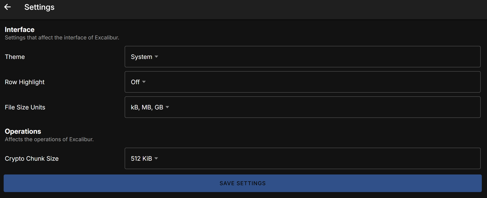

    <em>A trustless, secure file management solution using military-grade encryption.</em>

## Features

- ✨ **User-Friendly**: Simple, intuitive interface that makes secure file storage effortless.
- 🛡️ **Military-Grade Security**: State-of-the-art encryption algorithms protect your files at rest and in transit.
- 🕵️ **Zero-Trust By Default**: Designed with zero-trust principles in mind. Trust no one but yourself.
- 🔒 **End-to-End Encryption**: Data in transit are always encrypted using AES-GCM.
- 🗝️ **Zero-Knowledge Authentication**: Your password never leaves your device.
- 📱 **Multi-Platform**: Available as an Android app and a Progressive Web App (PWA).
- 📦 **Open Source**: Fully transparent and auditable codebase for maximum trust.
- 🗺️ **Attestations**: Everything has a publicly traceable provenance.
- 🖥️ **Self-Hostable**: Deploy your own instance for complete control over your data.

## Screenshots

## Quick Start

Follow the [quickstart guide](https://excalibur.photonic.dev/docs/category/quickstart) for a step-by-step guide to get started.

## Contributing

Contributions are welcome! Please read our [Contributing Guidelines](./.github/CONTRIBUTING.md) for details on how to submit pull requests.

## Security

See [SECURITY.md](./.github/SECURITY.md).
