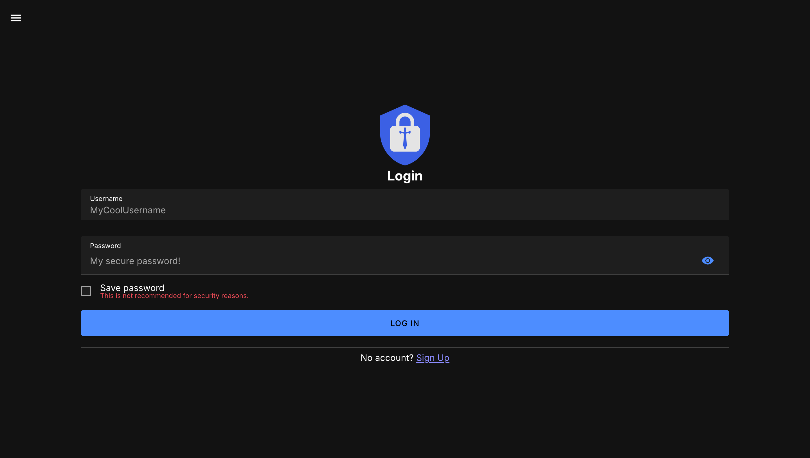
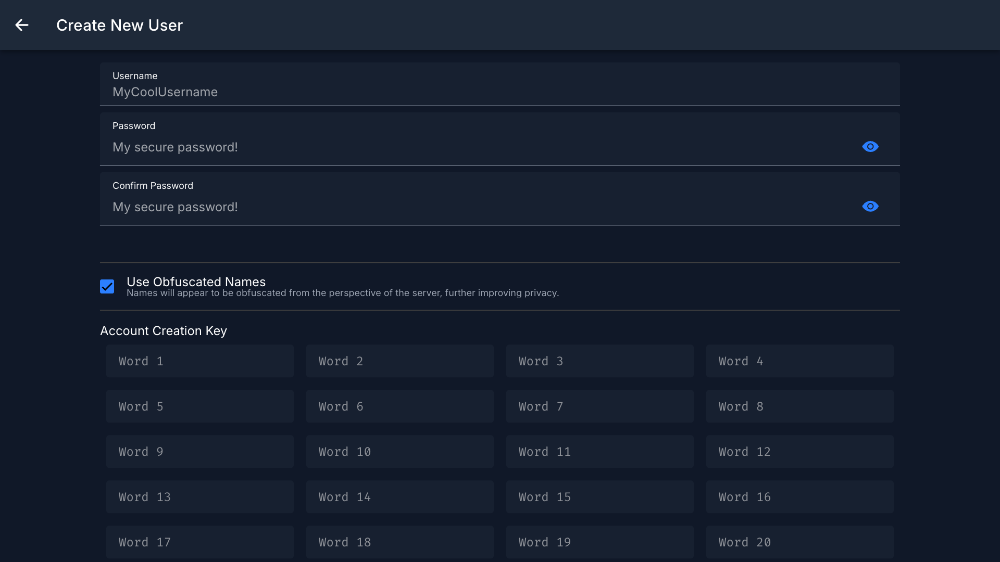
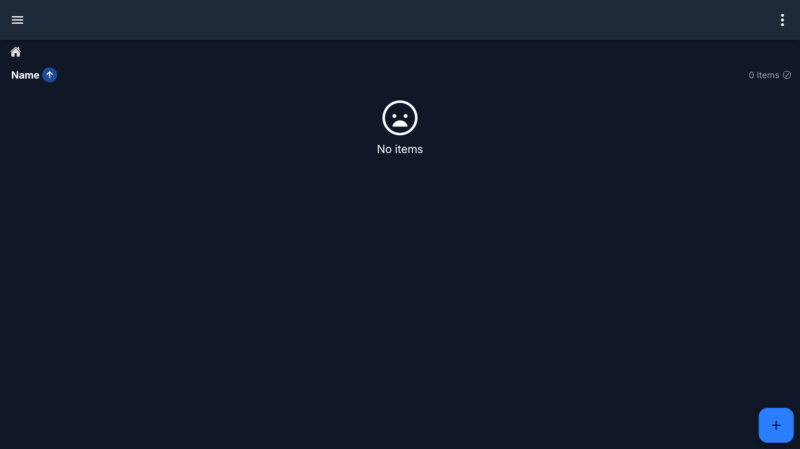
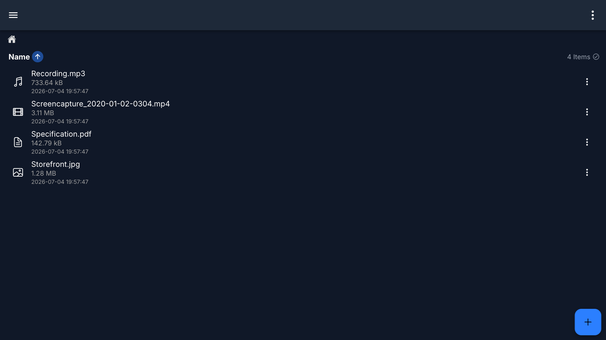

    <em>A trustless, secure file management solution using zero-trust security and enterprise-grade encryption.</em>

    
    
    
     
    
    
    

## Features

- 🛡️ **Enterprise-Grade Security**: The time-proven encryption algorithm AES-256-GCM protects your files at rest and in transit.
- ✨ **User-Friendly**: Boasting a simple and intuitive interface that makes secure file storage effortless.
- 🗝️ **Zero-Trust By Default**: Verify both your identity and the server's identity using the state-of-the-art [OPAQUE protocol](https://datatracker.ietf.org/doc/html/rfc9807) without ever revealing your password.
- 📜 **Open Source and Attested**: A fully transparent and auditable codebase with a publicly traceable provenance for maximum trust and transparency.
- 📱 **Multi-Platform**: Available as a desktop app, an Android app, and a Progressive Web App (PWA).
- 🖥️ **Self-Hostable**: Deploy your own instance for complete control over your data.

## Screenshots

## Quick Start

Follow the [quickstart guide](https://excalibur.photonic.dev/docs/category/quickstart) for a step-by-step guide to get started!

## Contributing

Contributions are welcome! Please read our [Contributing Guidelines](./.github/CONTRIBUTING.md) for details on how to submit pull requests.

## Security

Please read our [security policy](./.github/SECURITY.md).

## License

Excalibur is licenced under the GNU General Public License v3.0 (GPLv3). See [LICENSE](./LICENSE) for more information.

## Credits

Read the [credits page](https://excalibur.photonic.dev/credits/) for more information.
