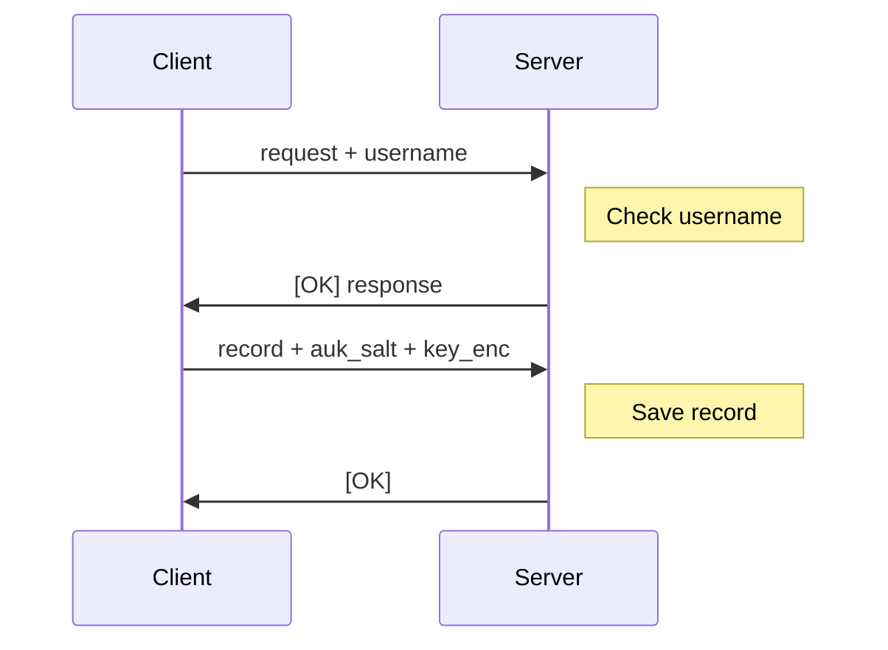
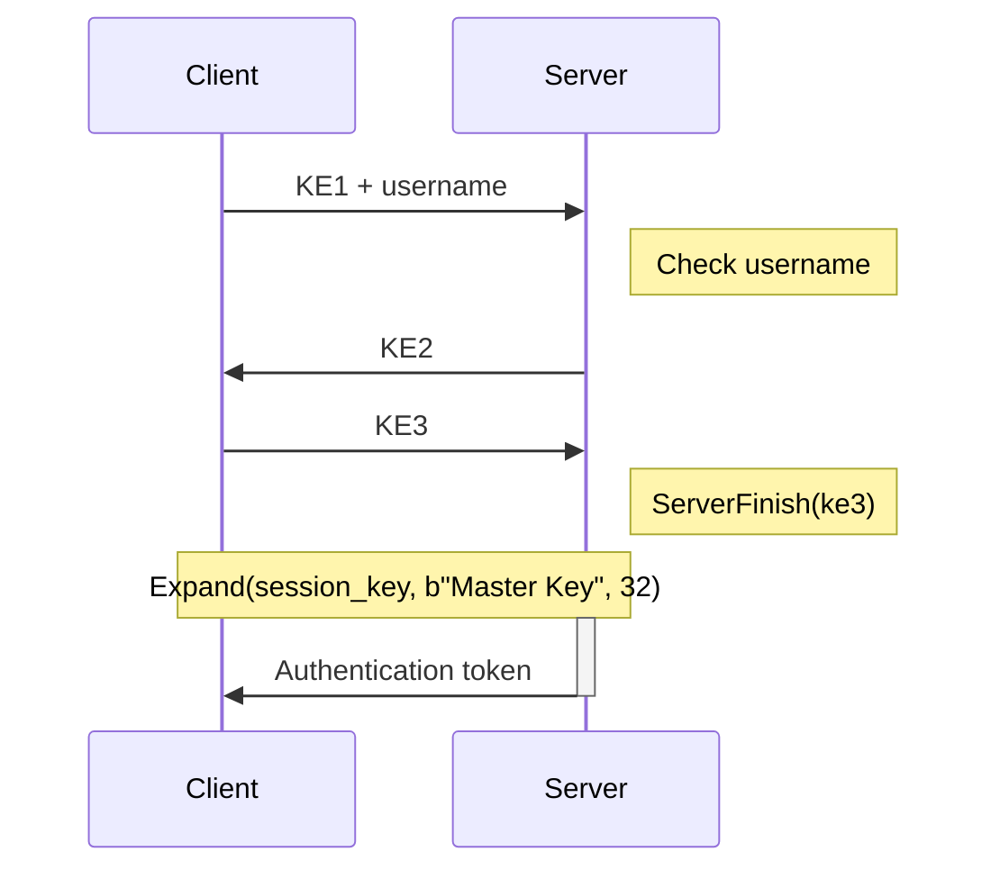

# OPAQUE Protocol

## Commands

Create `test-user-opaque`:

```sh
excalibur user add --username test-user-opaque --password Password --vault-key g7uMn17DkmWI3PBtxmiCLnQf34nXuEfpgexHUNBMOW0= --auth-protocol=OPAQUE-3DH
```

## Process Diagrams

### Registration



### Login


