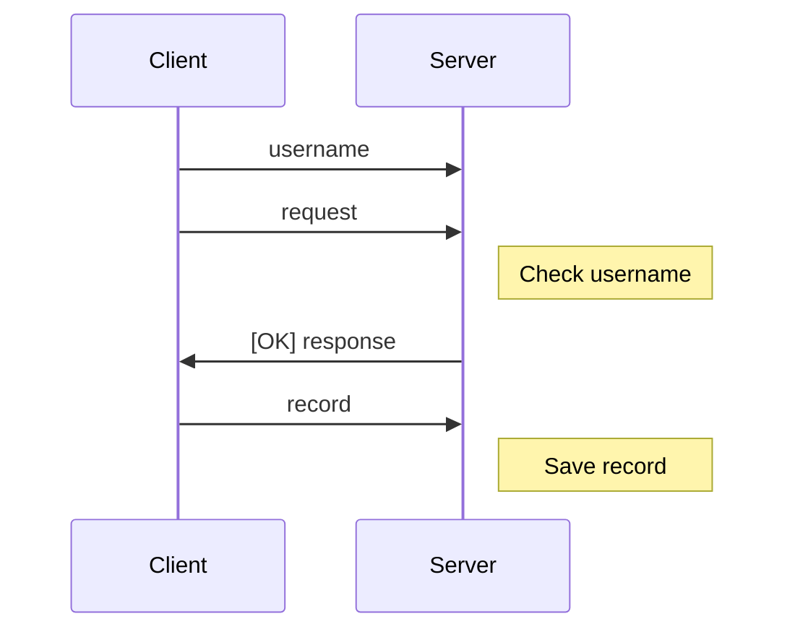
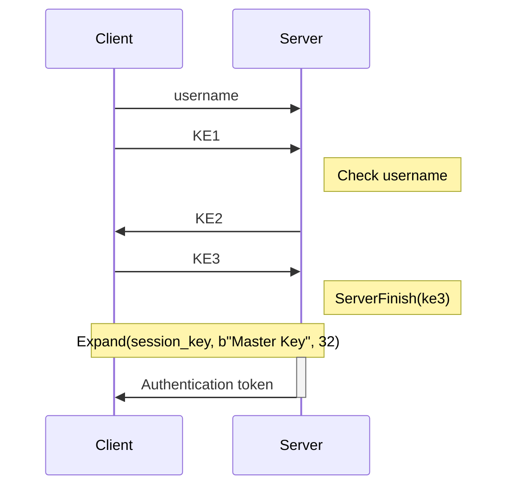

# OPAQUE Protocol

## Registration

```mermaid
sequenceDiagram
    participant C as Client
    participant S as Server

    C->>S: username
    C->>S: request
    Note right of S: Check username
    S->>C: [OK] response
    C->>S: record
    Note right of S: Save record
```

## Login

```mermaid
sequenceDiagram
    participant C as Client
    participant S as Server

    C->>S: username
    C->>S: KE1
    Note right of S: Check username
    S->>C: KE2
    C->>S: KE3
    Note right of S: ServerFinish(ke3)
    Note over C,S: Expand(session_key, b"Master Key", 32)
    activate S
    S->>-C: Authentication token
```
