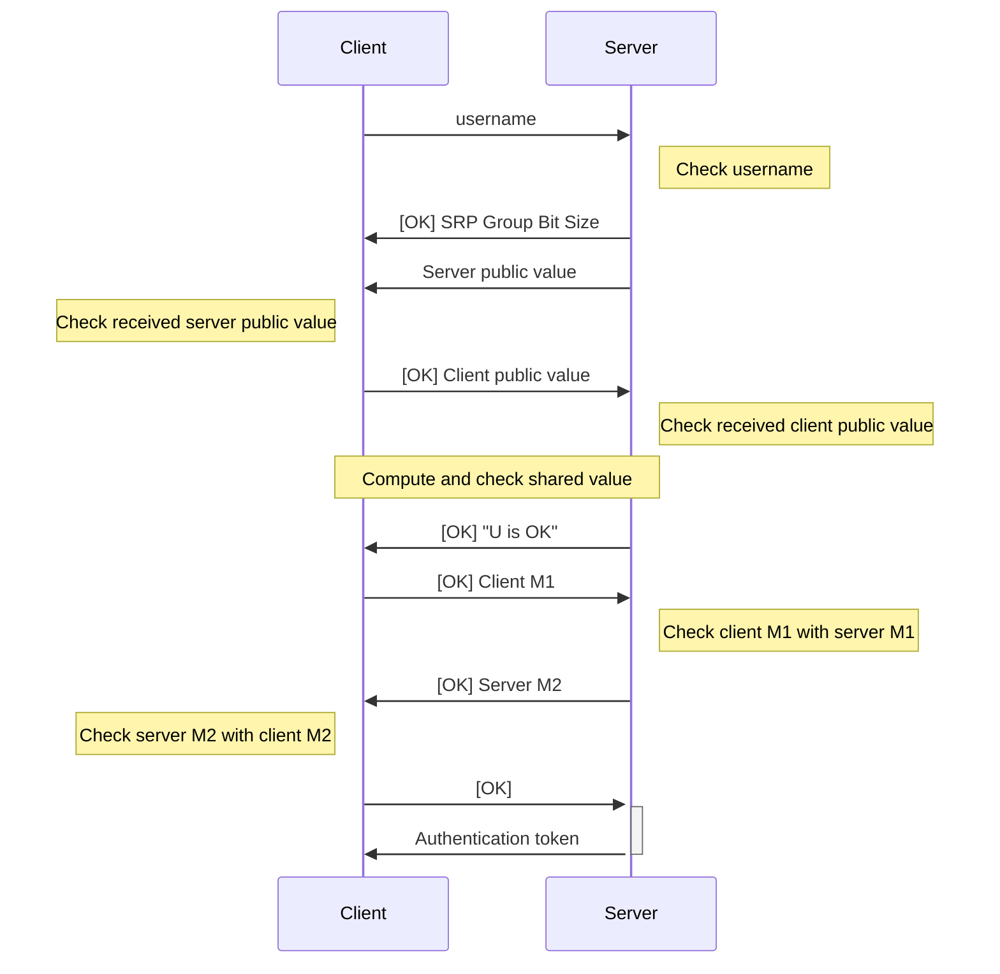

# Authentication

TODO: Tidy up

https://gchq.github.io/CyberChef/#recipe=HMAC(%7B'option':'UTF8','string':'one%20demo%2016B%20key'%7D,'SHA256')&input=R0VUIC91c2Vycy92YXVsdC90ZXN0LXVzZXIgMTAwMDAwMDAwMCBhYmNkYWJjZGFiY2RhYmNkIA

## Initial Authentication

Authentication with the server is achieved by the SRP protocol.

## Authenticating Subsequent Requests

Subsequent requests are authenticated using _both_ the authentication token and a HMAC.

The parameters of the HMAC are as follows:

- The method is the HTTP method (e.g., GET, POST, PUT, DELETE), in ALL CAPS.
- The path is the path of the request.
- The timestamp is the current time in seconds since the Unix epoch.
- The nonce is a random 16 byte value, expressed as a hex string.
- The `tail` is either
  - an empty string if the request does not have a body (e.g., GET requests) or does not specify `X-Encrypt: true`; or
  - the ExEF footer of the request body if the request has a body (e.g., POST requests) **and** specifies `X-Encrypt: true`

The HMAC is of the message `{METHOD} {PATH} {TIMESTAMP} {NONCE} {TAIL}` using the SRP master key as the key, and using SHA-256 as the hash function.

This header's value is `{NONCE} {TIMESTAMP} {HMAC}`, where `HMAC` is a hex string. The HMAC is provided in a header `X-SRP-HMAC`.
