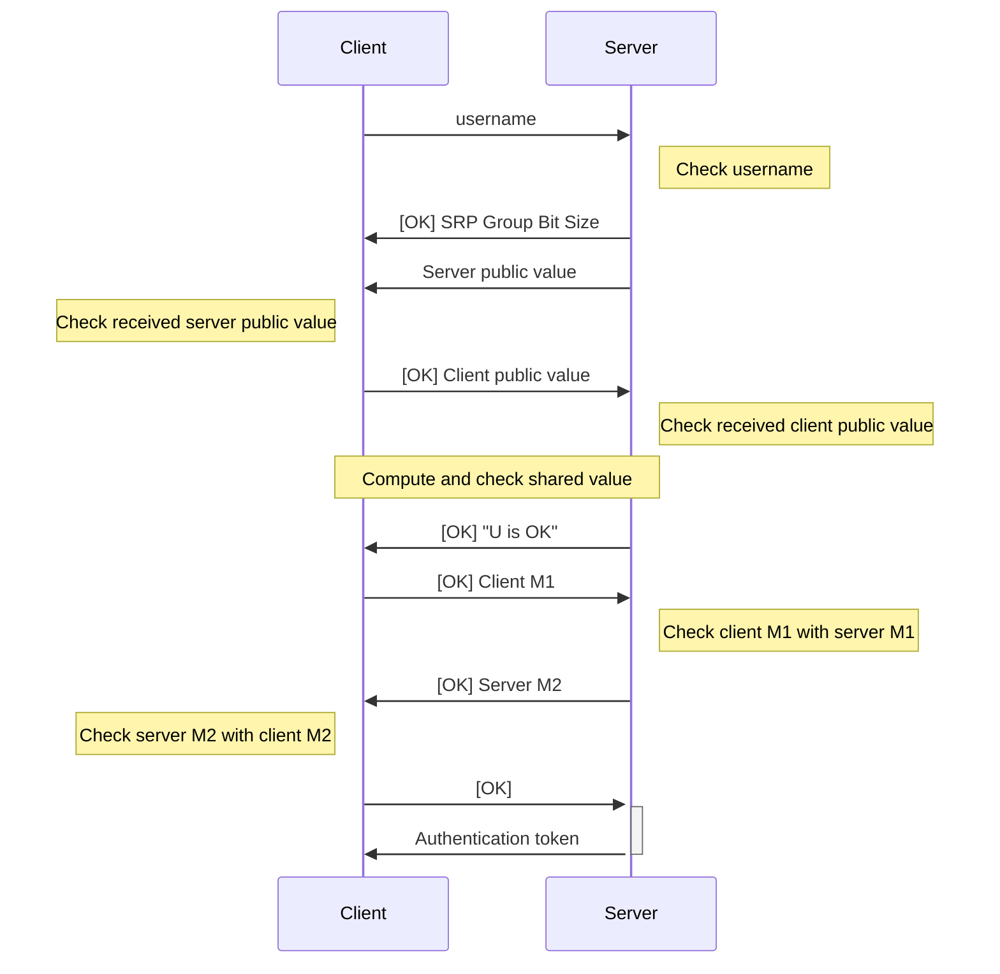

# Authentication

TODO: Tidy up

https://gchq.github.io/CyberChef/#recipe=HMAC(%7B'option':'UTF8','string':'one%20demo%2016B%20key'%7D,'SHA256')&input=R0VUIC9hcGkvYXV0aC9kZW1vIDEwMDAwMDAwMDAgYWJjZGFiY2RhYmNkYWJjZA

## Initial Authentication

Authentication with the server is achieved by the SRP protocol.

## Authenticating Subsequent Requests

Subsequent requests are authenticated using _both_ the authentication token and a HMAC, in a proof-of-possession (PoP) scheme.

The parameters of the HMAC are as follows:

- The method is the HTTP method (e.g., GET, POST, PUT, DELETE), in ALL CAPS.
- The path is the path of the request.
- The timestamp is the current time in seconds since the Unix epoch.
- The nonce is a random 16 byte value, expressed as a hex string.

The HMAC is of the message `{METHOD} {PATH} {TIMESTAMP} {NONCE}` using the SRP master key as the key, and using SHA-256 as the hash function.

This header's is `X-SRP-PoP` and its value is `{NONCE} {TIMESTAMP} {HMAC}`, where `HMAC` is a hex string.

> [!NOTE] Why Not Include the Body?
> The body of the message need not be included in the HMAC calculation since it is already verified by the encryption:
>
> - If the request does not include a body, then there is already nothing to check;
> - If the request does include a body, the body _should_ be encrypted using AES-GCM, which authenticates the data sent. Since the data sent uses the secret master key, no malicious actor can spoof the data; thus no need to check.
