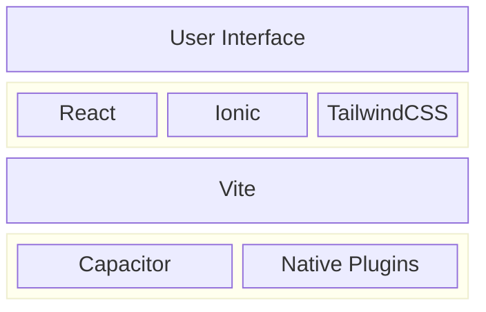
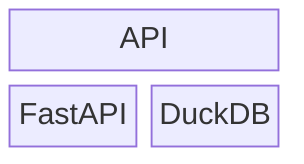

# Architecture

Explore what Excalibur's application architecture looks like.

## Client

The client application is primarily built using modern web technologies while also providing native support for mobile and desktop platforms.

### Layers

The diagram below summarizes the different layers of the client application.

- The top layer is the user interface. This is the primary way users interact with the application.
- The layer below the user interface is the PWA layer. This layer is responsible for handling the interface operations and design.
    - [**React**](https://react.dev) provides the core framework for building the user interface.
    - [**Ionic**](https://ionicframework.com) provides pre-built components that can be used on any platform. This allows the application to match the design conventions of whatever device it is running on.
    - [**TailwindCSS**](https://tailwindcss.com) provides the styling for the user interface.

    TypeScript is used to ensure type safety and catch errors early in the development process.

- The compile layer is responsible for compiling all the parts in the PWA layer into a bundle that can be run in the browser. We use [**Vite**](https://vite.dev) to handle this.

- The final layer can be thought of as the native layer. With the PWA compiled, this layer is responsible for handling the platform-native calls from the PWA layer.
    - [**Capacitor**](https://capacitorjs.com) provides a native runtime for building Web Native apps, and allows the application to be run across different platforms.
    - Various [**native plugins**](https://capacitorjs.com/docs/plugins) provide additional functionality that was not provided by Capacitor.

    The result of all of this is a distributable that is platform-specific.

### How The Application's UI Stays Consistent

As shown, the layer that actually handles the design of the user interface is the PWA layer, which does not change between platforms. The only thing that significantly changes between platforms is the native layer, which changes the behaviour (and not the design) of the application.

This is why we use Capacitor to handle the native layer, as it provides a consistent API for different platforms.

## Server

The structure of the API server is significantly simpler than the client application. It is built using Python and FastAPI and provides the backend services for the Excalibur platform.

- Like the user layer for the client application, this layer is what is exposed to client applications. All (user-facing) functionality implemented by Excalibur is available at this layer.

- The processing layer handles the core of Excalibur's functionality. We use [**FastAPI**](https://fastapi.tiangolo.com) to efficiently build and develop this layer, and use [**DuckDB**](https://duckdb.org) to handle persistent user management and storage. We use python to create the server application.
