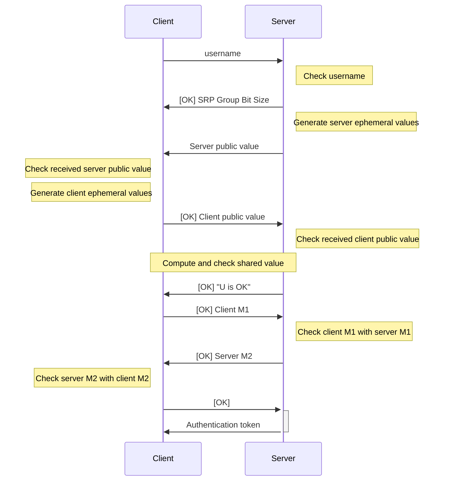

# Authentication

Excalibur uses Secure Remote Password (SRP) protocol combined with Proof-of-Possession (PoP) to ensure secure authentication.

## Initial Authentication

Although some of the endpoints of the server is available without authentication, any client who wishes to access their files need to authenticate themselves with the server.

The initial authentication process uses a [WebSocket](https://en.wikipedia.org/wiki/WebSocket) connection to the `/api/auth` endpoint. The rough process is as follows:



Let us examine the process in more detail.

### Message Format

Each message is a JSON object containing the following fields:

- `status`: Current authentication status. Can be `OK`, `ERR`, or null.
- `binary`: Whether the included data is binary data. Can be `true` or `false`.
- `data`: Message data. If `binary` is true, this field is a Base64 encoded byte array. Otherwise, it is a ASCII string.

Here are two examples of messages:

```json
{
    "status": "OK",
    "binary": false,
    "data": "U is OK"
}
```

```json
{
    "status": null,
    "binary": true,
    "data": "AQ=="
}
```

### Specification

Let

- $N$ denote the SRP prime according to [RFC5054, Appendix A](https://datatracker.ietf.org/doc/html/rfc5054#appendix-A);
- $g$ denote the SRP generator according to [RFC5054, Appendix A](https://datatracker.ietf.org/doc/html/rfc5054#appendix-A);
- $k$ denote the SRP multiplier according to [RFC5054, Section 2.6](https://datatracker.ietf.org/doc/html/rfc5054#section-2.6);
- $x$ denote the SRP-$x$ key generated on the client-side; and
- $v = g^x \mod N$ be the verifier value.

:::danger

$x$ and $v$ should be treated as secrets. The server should **never** gain access to $x$, and no one other than the server and client should gain access to $v$.

:::

The initial authentication process is as follows:

1. Client sends its username to the server.
2. Server checks whether it has a record of the requested username.
    - Username not found: sends message with status `ERR` and data `User does not exist`. Terminate connection.
3. Server sends message with status `OK` and the SRP group size as an ASCII string (e.g., `1024`).
4. Server generates its ephemeral values (private value $b$ and public value $B = (kv + g^b) \mod N$) and sends the public value $B$ to the client (setting `binary = true`).
5. Client checks received $B$.
    - If $B$ is invalid (e.g., $B \mod N = 0$), sends message with status `ERR` (data can be anything). Can choose to terminate, or wait for server to try another $B$.
6. Client generates its ephemeral values (private value $a$ and public value $A = g^a \mod N$) and sends the public value $A$ to the server (setting `binary = true`) with status `OK`.
7. Server checks received $A$.
    - If $A$ is invalid (e.g., $A \mod N = 0$), sends message with status `ERR` (data can be anything). Can choose to terminate, or wait for client to try another $A$.
8. Both client and server computes $u = \texttt{SHA1}(A || B)$ where $||$ refers to concatenation. Note that $A$ and $B$ have been padded to SRP group size bits using zero padding.
    - If server detects $u \equiv 0 \pmod N$, sends message with status `ERR` and data `Shared U value is 0`. Terminate connection.
    - If client detects $u \equiv 0 \pmod N$, can just choose to close connection.
9. Server sends message with status `OK` and data `U is OK`.
10. Client and server each computes their premaster:
    - Client: $\texttt{preK} = (B - kg^x)^{a + ux} \mod N$
    - Server: $\texttt{preK} = (Av^u)^b \mod N$

    The master $K$ is computed by computing SHA3-256 of the premaster, padded to the SRP group size bits using zero padding.

11. Client computes $M_1 = H((H(N) \oplus H(g)) \; || \; \texttt{username} \; || \; \texttt{salt} \; || \; A \; || \; B \; || \; K_{\texttt{client}})$, where $\oplus$ means XOR and $H$ is SHA3-256. Client sends $M_1$ to the server (setting `binary = true`) with status `OK`.
12. Server computes its own $M_1$ value using the same formula (using $K_{\texttt{server}}$ in place of $K_{\texttt{client}}$), and checks with the received $M_1$.
    - If they do not match, sends message with status `ERR` and data `M1 values do not match`. Terminate connection.
13. Server computes $M_2 = H(A \; || \; M_1 \; || \; K_{\texttt{server}})$ and sends it to the client (setting `binary = true`) with status `OK`.
14. Client computes its own $M_2$ value using the same formula (using $K_{\texttt{client}}$ in place of $K_{\texttt{server}}$), and checks with the received $M_2$.
    - If they do not match, terminate connection.
15. Client sends message with status `OK` with no data.
16. Server prepares [authentication token](#authentication-token) in the form of a JWT. Encrypts it with shared master key $K$ using AES-GCM-256.
17. Server sends message with no status and JSON data containing three fields: `nonce`, `token`, and `tag`.
    - `nonce`: A random value, as a Base64 encoded byte array.
    - `token`: The encrypted JWT, as a Base64 encoded byte array.
    - `tag`: The authentication tag, as a Base64 encoded byte array.
18. Both sides close connection.

:::note

The full code that implements the server-side checking can be found in the [`comms.py` file](https://github.com/PhotonicGluon/Excalibur/blob/main/server/excalibur_server/api/routes/auth/comms.py).

:::

## Authenticating Subsequent Requests

Once this initial authentication process is complete, future requests to secure endpoints will require the use of the authentication token obtained from the server. Do note that the body of the request and response will be encrypted using [the Excalibur Encryption Format (ExEF)](./06-encryption-format.md).

### Authentication Token

The authentication token is a JWT that contains the following claims:

- `sub`: The subject of the token, which is the username.
- `iat`: The issued at time of the token, which is the current time.
- `exp`: The expiration time of the token.
    - Currently the token expires after one hour.
- `uuid`: Comms UUID used in the [Proof-of-Possession (PoP)](#proof-of-possession-pop) process.

An example of JWT (which has an invalid JWT signature) is as follows:

```
eyJhbGciOiJIUzI1NiIsInR5cCI6IkpXVCJ9.ewogICAgInN1YiI6ICJNeUNvb2xVc2VybmFtZSIsCiAgICAiaWF0IjogMTUxNjIzOTAyMiwKICAgICJleHAiOiAxNTE2MjQyNjIyLAogICAgInV1aWQiOiAiMTIzZTQ1NjctZTg5Yi0xMmQzLWE0NTYtNDI2NjE0MTc0MDAwIgp9.KMUFsIDTnFmyG3nMiGM6H9FNFUROf3wh7SmqJp-QV30
```

which has the following data (expressed in JSON):

```json
{
    "sub": "MyCoolUsername",
    "iat": 1516239022,
    "exp": 1516242622,
    "uuid": "123e4567-e89b-12d3-a456-426614174000"
}
```

### Proof-of-Possession (PoP)

A proof-of-possession (PoP) value needs to be computed in addition to providing the authentication token. This value is computed using a HMAC of the message `<METHOD> <PATH> <TIMESTAMP> <NONCE>`, where

- `<METHOD>` is the HTTP method (e.g., `GET`, `POST`, `PUT`, `DELETE`) in ALL CAPS;
- `<PATH>` is the path of the request (e.g., `/some/path/here`);
- `<TIMESTAMP>` is the current time _in seconds_ since the Unix epoch; and
- `<NONCE>` is a random 16 byte value.

:::note Why Not Include the Body?

The body of the message need not be included in the HMAC calculation since it is already verified by the encryption:

- If the request does not include a body, then there is already nothing to check;
- If the request does include a body, the body _should_ be encrypted using AES-GCM, which authenticates the data sent. Since the data sent uses the secret master key, no malicious actor can spoof the data; thus no need to check.

:::

The HMAC's key is the SRP master key $K$ and the hash algorithm used is SHA-256. The output PoP value is encoded using Base64 for ease of transmission.

A CyberChef demonstration of the PoP generation process can be found [here](<https://gchq.github.io/CyberChef/#recipe=HMAC(%7B'option':'UTF8','string':'one%20demo%2016B%20key'%7D,'SHA256')From_Hex('Auto')To_Base64('A-Za-z0-9%2B/%3D')&input=R0VUIC9hcGkvYXV0aC9wb3AtZGVtbyAxMDAwMDAwMDAwIDAxMjM0NTY3ODlhYmNkZWY&oeol=FF>).

### Proving Possession

Requests to secure endpoints need _both_ the authentication token and a PoP header, and the request/response body will be encrypted using the SRP master key.

To prove that the user is who they claim to be, their request will need to include two headers:

- **`Authorization`**: The format of the header is `Bearer <JWT>` where `<JWT>` is the authentication token.
- **`X-SRP-PoP`**: The format of the header is `<TIMESTAMP> <NONCE> <PoP>` where `<PoP>` is the Base64 encoded PoP value computed as described above and `<TIMESTAMP>` and `<NONCE>` are the timestamp and nonce used to compute the PoP value, respectively.

Failing to provide both headers will result in a `401 Unauthorized` response.
