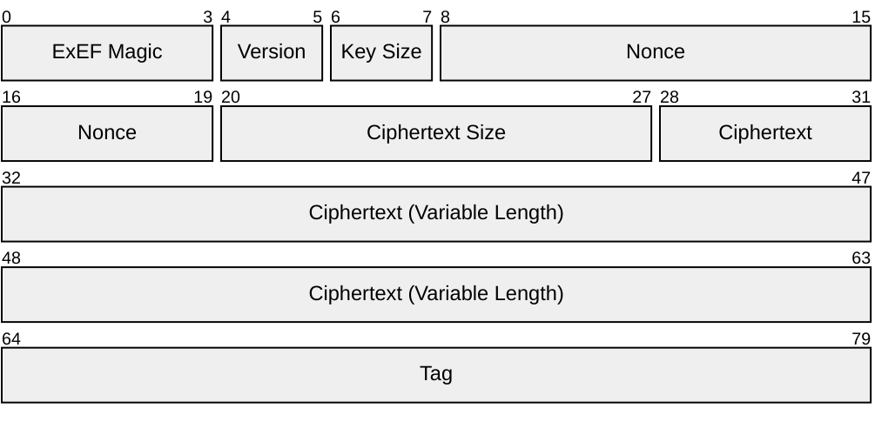

# Encryption Format

All traffic and files will be encrypted using the Excalibur Encryption Format (ExEF). Files with a file extension of `.exef` will use the Excalibur Encryption Format.

The following is a diagram of the ExEF format. The numbers represent 0-indexed _byte_ positions.

- Bytes `0` to `3` will be the ExEF magic constant: the ASCII string `ExEF`.
- Bytes `4` and `5` represent the ExEF version, which should be interpreted as an 2-byte unsigned integer.
    - The current version is `00 02`.
- Bytes `6` and `7` represent the AES-GCM key size, which should be interpreted as an 2-byte unsigned integer. There are currently only 3 supported values.
    - The bytes `00 80` represent `aes-128-gcm`.
    - The bytes `00 C0` represent `aes-192-gcm`.
    - The bytes `01 00` represent `aes-256-gcm`.
- Bytes `8` to `19` represent the 12-byte nonce used for AES-GCM encryption.
- Bytes `20` to `27` represent the ciphertext length, which should be interpreted as an 8-byte unsigned integer.
- The ciphertext follows.
- The last 16 bytes is the 16-byte AES-GCM tag.
