# Key Generation

This document describes the key generation process used in Excalibur, which is based on 1Password's key generation process as described in [their security whitepaper](https://1passwordstatic.com/files/security/1password-white-paper.pdf).

The key generation process can be concisely summarized in the following flowchart.

```mermaid
flowchart TD
    P[/Password/]
    S[/Salt/]
    I[/Username/]

    PBKDF[[PBKDF2 with 650,000 iterations]]
    HKDF[[HKDF using SHA256]]

    %% Password + Salt into PBKDF2
    P-->TrimAndNorm[Trim and Normalize Password]
    TrimAndNorm-->PBKDF
    S-->PBKDF

    %% Identity into HKDF
    I-->HKDF

    %% XOR HKDF output with PBKDF2 output
    PBKDF-->XOR((⊕))
    HKDF-->XOR
    XOR-->OK[Output Key]
```

Let's examine each step in detail.

1. **Password Normalization**
    1. Trim leading/trailing whitespace from the password
    2. Apply Unicode NFKD normalization to handle different character encodings
    3. Convert the normalized password to a UTF-8 byte array

2. **Slow Hash (PBKDF2)**
    - Algorithm: PBKDF2 with HMAC-SHA256
    - Iterations: 650,000
    - Input: Normalized password + Salt
    - Output: 32-byte derived key

3. **Fast Hash (HKDF)**
    - Algorithm: HKDF with SHA-256
    - Input: Username (as additional info) + Salt
    - Output: 32-byte derived key

4. **Key Combination**
    - The final master key is generated by XORing the outputs of the PBKDF2 and HKDF operations

Note that this key generation step is repeated **_twice_**. Why? Well, we need two keys for different purposes:

- A key for unlocking the vault[^vault-key], called the **Account Unlock Key** (AUK)
- A key for [SRP authentication](/docs/dev/03-authentication.md), called the **SRP Key**

[^vault-key]: More accurately, the key is actually used to decrypt the file that contains the vault key.

The reason for this is that we don't want a leak of the communication key (i.e., the SRP key) to compromise the vault, and vice versa. To accomplish this, two different salts (an `auk_salt` and a `srp_salt`) are used to generate the two keys.
