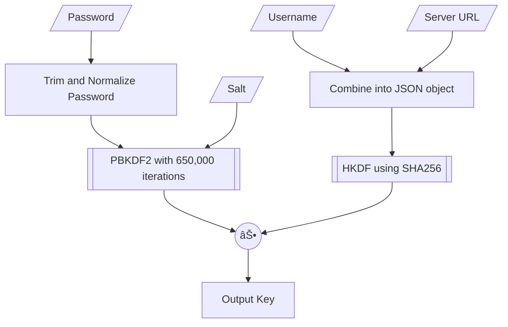

# Key Generation

TODO: Add

Adapted from 1Password's security whitepaper.

```mermaid
flowchart TD
    P[/Password/]
    S[/Salt/]
    I[/Username/]
    U[/Server URL/]

    PBKDF[[PBKDF2 with 650,000 iterations]]
    HKDF[[HKDF using SHA256]]

    %% Password + Salt into PBKDF2
    P-->TrimAndNorm[Trim and Normalize Password]
    TrimAndNorm-->PBKDF
    S-->PBKDF

    %% Identity and Server URL into HKDF
    I-->Combine[Combine into JSON object]
    U-->Combine
    Combine-->HKDF

    %% XOR HKDF output with PBKDF2 output
    PBKDF-->XOR((⊕))
    HKDF-->XOR
    XOR-->OK[Output Key]
```
