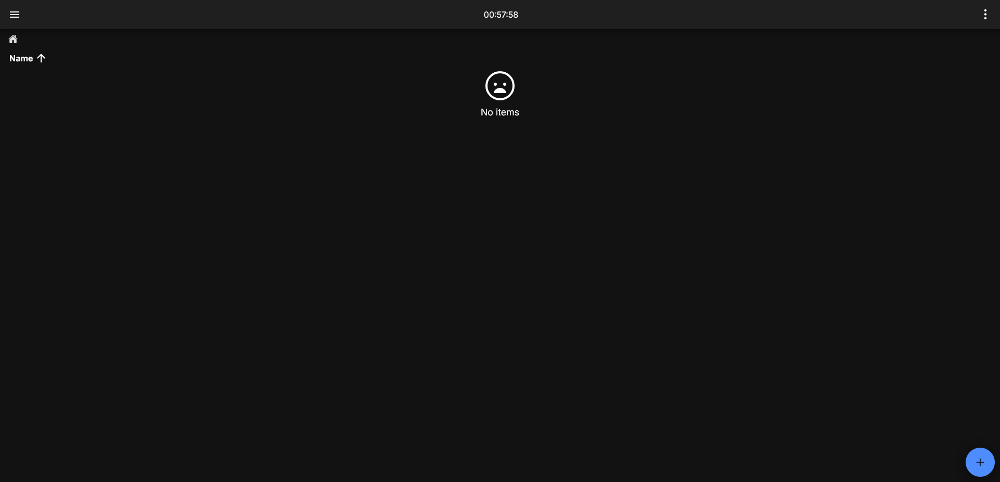
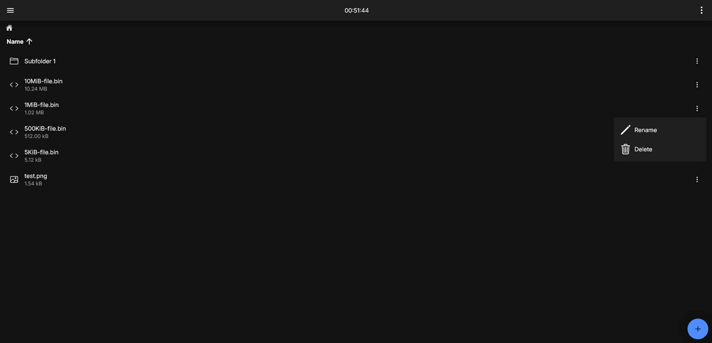

# Understanding the Interface

When you log in for the first time, the file explorer of the app should look something like this:

## Adding Items

The blue "+" button at the bottom of the screen allows you to add stuff. Tapping/clicking on it will expand it:

- The top option allows you to upload a file.
    - The file will be encrypted _before_ it is sent over the network, where it will be encrypted _again_. Thus, **the server only stores encrypted files**.
- The second option allows you to create a new folder.

Close the menu by clicking on the blue button again (which now displays "&times;").

## Navigation

After adding some items, your file explorer should look something like this:

- Tap on a _file_ to download and decrypt the file.
    - The file will be encrypted during transit.
    - File decryption happens _only_ on the client and **never** on the server.
- Tap on a _folder_ to navigate into it.
- Tap on the ellipsis on the side of an item to bring up a popup:
    - "Rename" allows you to rename the item.
    - "Delete" allows you to delete the item.

The top-right ellipsis menu has two options:

- "View Vault Key"
- "Open Excalibur Folder", which is only available on mobile platforms (for PWA, the files are downloaded to your device's Downloads folder)

You can sort the items in the file explorer by tapping on the up arrow on the side of "Name".

The countdown timer at the top of the screen shows how long your session lasts.

:::warning Countdown Expiry

Any upload that is performed _near_ or _after_ the countdown expires **may be partially or fully uploaded**. Avoid uploading files when the countdown is about to expire.
:::
