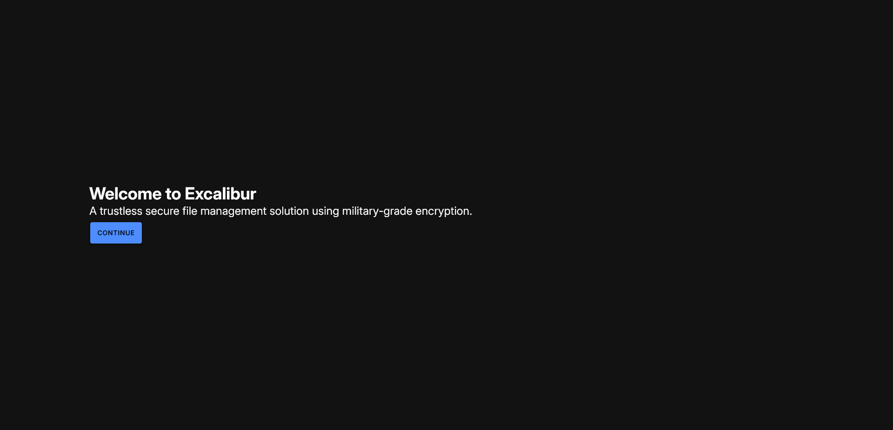
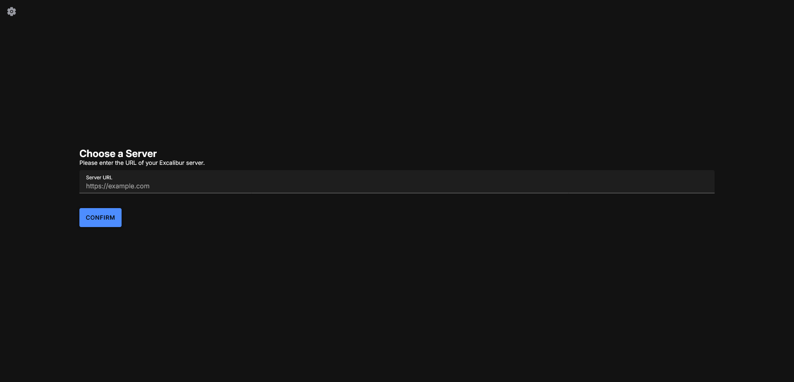
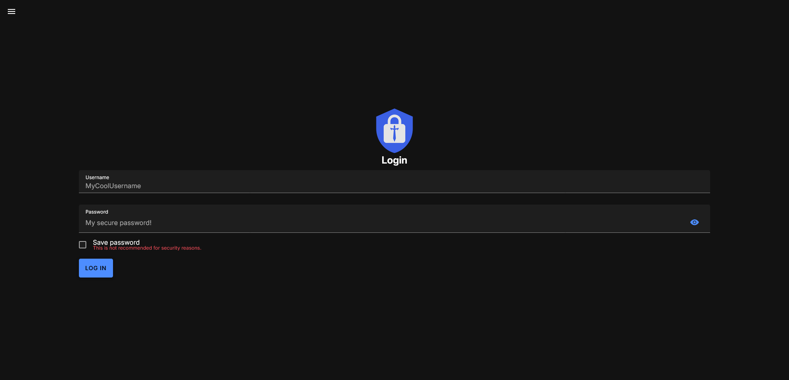

:::note

The images shown are captured from a PWA build of the app, but because of its [architecture](/docs/dev/architecture.md), the user interface should be similar for other platforms.

:::

Upon opening the app, you will be greeted with the following screen:
    

Click on "Continue". You should see a screen that allows you to enter a server URL:

Assuming you have set up the server as per the [Server Quickstart](../01-server.md), enter `http://localhost:8888` and click "Continue".

You should now see a login screen:

