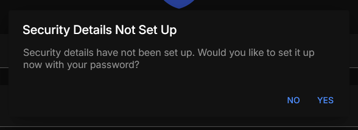
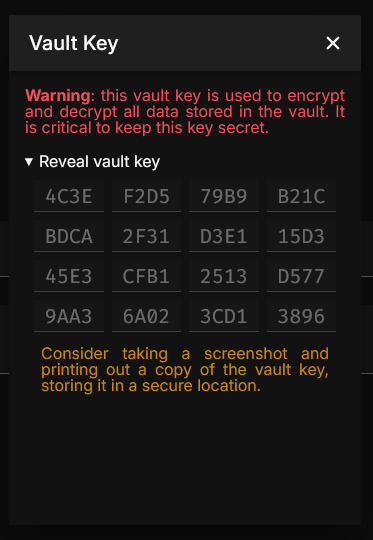

import Tabs from "@theme/Tabs";
import TabItem from "@theme/TabItem";
import CommonInitialSignup from "./_common-initial-signup.mdx";

# Client Quickstart

Set up a client to connect to an Excalibur server.

:::important

This quickstart assumes that a [server](../01-server.md) is already set up.

:::

## Obtaining the Client Distributable
<Tabs groupId="platform">
    <TabItem value="android" label="Android" default>
        TODO: Add android setup
    </TabItem>
    <TabItem value="pwa" label="Progressive Web App (PWA)">
        TODO: Add PWA setup
    </TabItem>
</Tabs>

## Setting Up the Client
<Tabs groupId="platform">
    <TabItem value="android" label="Android" default>
        TODO: Add android setup
    </TabItem>
    <TabItem value="pwa" label="Progressive Web App (PWA)">
        TODO: Add PWA setup
    </TabItem>
</Tabs>

## Signup and Login

<Tabs>
    <TabItem value="on-server" label="On Server" default>
    You have the option to create a new user *directly on the server*. This is the recommended method for initial signup.

    TODO: Add

    Now we can proceed to logging in on the app.

    <CommonInitialSignup/>

    Enter your username and password into the fields, then click "Log In". You should be redirected to the main screen.

    </TabItem>
    
    <TabItem value="on-app" label="Setup On App">
    <CommonInitialSignup/>

    Enter your desired username and password into the fields, then click "Log In". You should see the following pop up:

    

    This indicates that your user is not yet registered on the server. Click "Yes" to continue.

    :::danger For The Paranoid

    Although your password is **not** sent over the network, this signup process is ***not encrypted***. Anyone listening to your network traffic can a critical value required to verify the authenticity of the server.

    For more information, see the [authentication protocol](/docs/dev/authentication.md).

    :::

    Once that is done, you should see a new pop up titled "Vault Key":

    

    This key is the actual key used to encrypt your data. It is ***extremely unlikely*** that you will need to use this key, but it is recommended to keep it in a secure location. Once you have saved this key, click the "X" button to close the pop up.

    Now you can click on "Log In" to log in to your account.
    </TabItem>
</Tabs>

Congratulations! You have successfully set up a client to connect to an Excalibur server. Move on to learning what the [interface](../../interface.md) looks like.
