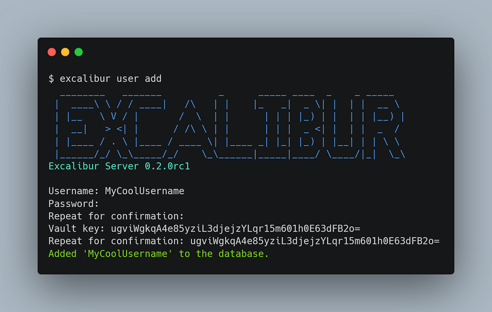

import Tabs from "@theme/Tabs";
import TabItem from "@theme/TabItem";
import CommonOnboarding from "./_common-onboarding.mdx";

# Client Quickstart

Set up a client to connect to an Excalibur server.

:::important

This quickstart assumes that a [server](../01-server.mdx) is already set up.

:::

## Installation

<Tabs groupId="platform">
    <TabItem value="android" label="Android" default>
    The Android client is an Android app in the form of an `.apk` file.

    1. Download the Android app from <a href="/download?type=app-android" target="_blank">here</a>; you should now have an `.apk` file.
    2. Copy the `.apk` file to your Android device.
    3. Install the app on your Android device.
        - Do note that you may need to enable installation from unknown sources on your Android device in order to install the `.apk` file.

    :::warning

    It is recommended to *disable* the installation of unknown sources on your Android device after installing the app.
    
    :::

    </TabItem>

    <TabItem value="pwa" label="Progressive Web App (PWA)">
    :::note
    
    If you obtained a server distributable that includes the PWA, you just need to access the PWA at [`http://localhost:8888`](http://localhost:8888) (or wherever your server is hosted).

    :::
    
    The PWA distributable is simply a zip file containing all the web assets to run a PWA.

    1. Download the PWA distributable from <a href="/download?type=app-pwa" target="_blank">here</a>.
    2. Extract the contents of the zip file to a folder of your choice. It should contain a `dist` folder. This is the PWA.

    By running a HTTP server and serving the files in `dist`, you can access the PWA. For example, using Python, you can run

    ```bash
    python -m http.server 8080
    ```

    within the `dist` folder to serve the files. Navigating to [`http://localhost:8080`](http://localhost:8080) should bring you to the PWA.

    :::warning

    The above Python command is not safe for production use. It is only for trying out Excalibur via a PWA. It is recommended to use the other client distributables.

    :::
    </TabItem>
</Tabs>

## Creating a User

<Tabs groupId="user-creation-method">
    <TabItem value="on-server" label="On Server" default>
    You have the option to create a new user *directly on the server*. This is the ***recommended*** method for initial signup, since it does not involve sending any sensitive values over the wire.

    On the same device that the server is running, open a terminal and run

    ```bash
    excalibur user add
    ```

    You will see a prompt like the following:
    
    
    
    Fill in the following details:
    - Username
    - Password
    - Vault Key (which should be entered as a Base64 string representing 32 bytes)
        - You can generate a vault key using [this CyberChef recipe](https://gchq.github.io/CyberChef/#recipe=Pseudo-Random_Number_Generator(32,'Raw')To_Base64('A-Za-z0-9%2B/%3D')).

    :::tip

    You can also specify these values as flags in the above command:

    ```bash
    excalibur user add --username USERNAME --password PASSWORD --vault-key BASE64_VAULT_KEY
    ```

    :::

    You should receive a confirmation message like `Added 'USERNAME' to the database`. That means you have successfully created a user! Now we can proceed to logging in on the app.

    </TabItem>
    
    <TabItem value="on-app" label="On App">
    :::danger For The Paranoid

    Although your password is **not** sent over the network, this signup process is ***not encrypted***. Anyone listening to your network traffic can sniff a critical value required to verify the authenticity of the server.

    For more information, see the [authentication protocol](/docs/dev/03-authentication.md).

    :::

    You can create a user via the app's interface.

    <CommonOnboarding />

    Enter your desired username and password into the fields, then click "Log In". You should see the following pop up:

    

    This indicates that your user is not yet registered on the server. Click "Yes" to continue.

    Once that is done, you should see a new pop up titled "Vault Key":

    

    This key is the actual key used to encrypt your data. It is ***extremely unlikely*** that you will need to use this key, but it is recommended to keep it in a secure location. Once you have saved this key, click the "X" button to close the pop up.

    </TabItem>
</Tabs>

## Logging In

<Tabs groupId="user-creation-method">
    <TabItem value="on-server" label="On Server" default>

    <CommonOnboarding/>

    Enter your username and password into the fields, then click "Log In". You should be redirected to the main screen.

    </TabItem>
    
    <TabItem value="on-app" label="On App">
    Simply click on "Log In" to log in to your account:

    
    </TabItem>
</Tabs>

Congratulations! You have successfully set up a client to connect to an Excalibur server. Move on to learning what the [interface](../../interface.md) looks like.
