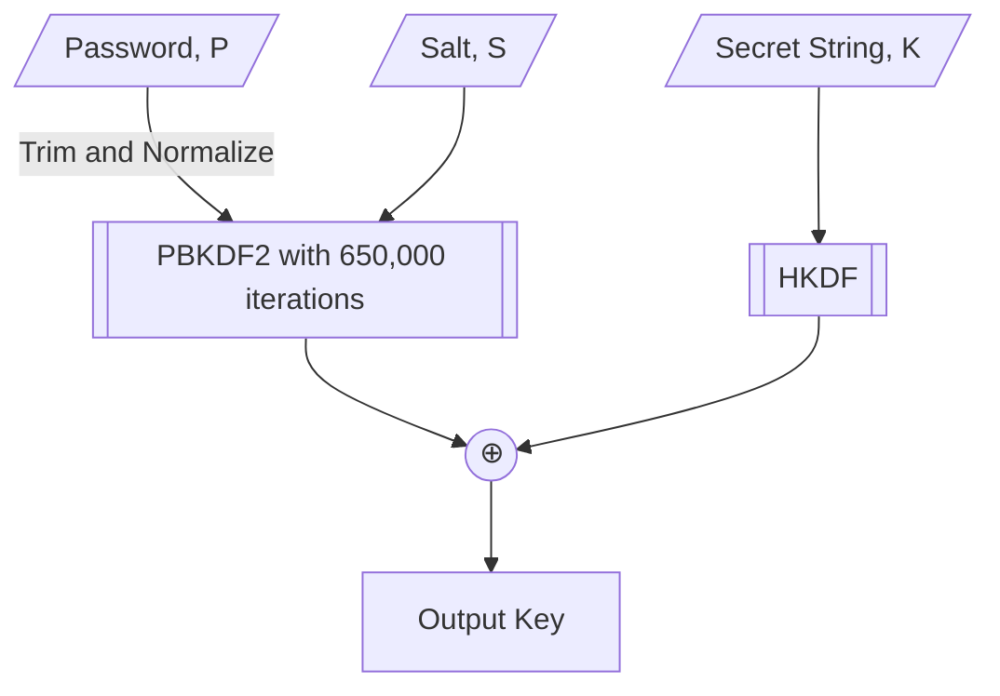

# Key Generation

TODO: Update

Adapted from 1Password's security whitepaper.

```mermaid
flowchart TD
    P[/Password, P/]
    K[/Secret String, K/]
    S[/Salt, S/]

    PBKDF[[PBKDF2 with 650,000 iterations]]
    HKDF[[HKDF]]

    %% Password + Salt into PBKDF2
    P-->|Trim and Normalize|PBKDF
    S-->PBKDF

    %% Secret key into HKDF
    K-->HKDF

    %% XOR HKDF output with PBKDF2 output
    PBKDF-->XOR((⊕))
    HKDF-->XOR
    XOR-->OK[Output Key]
```
