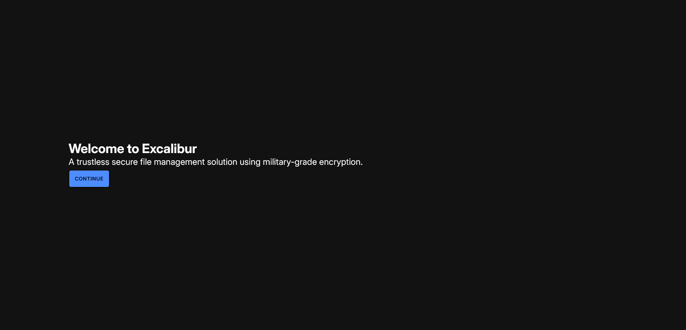
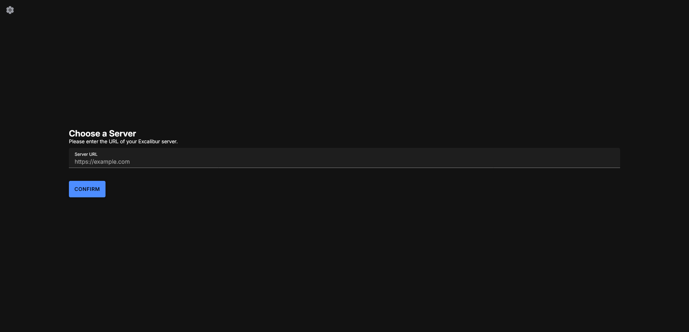
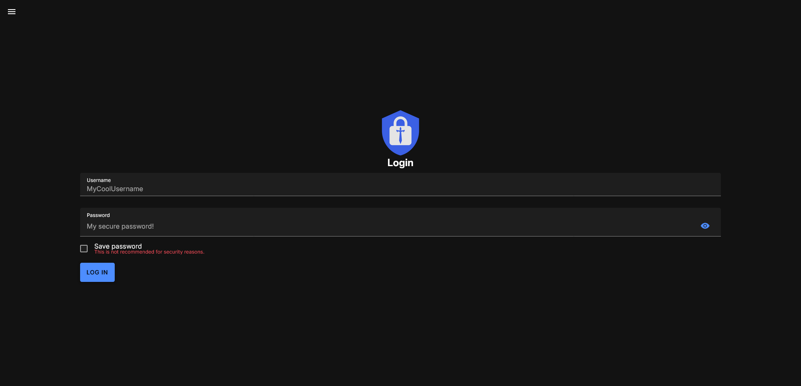

import Tabs from '@theme/Tabs';
import TabItem from '@theme/TabItem';

# Client Quickstart

Set up a client to connect to an Excalibur server.

:::important

This quickstart assumes that a [server](./01-server.md) is already set up.

:::

### Obtaining the Client Distributable
<Tabs groupId="platform">
    <TabItem value="android" label="Android" default>
        TODO: Add android setup
    </TabItem>
    <TabItem value="pwa" label="Progressive Web App (PWA)">
        TODO: Add PWA setup
    </TabItem>
</Tabs>

### Setting Up the Client
<Tabs groupId="platform">
    <TabItem value="android" label="Android" default>
        TODO: Add android setup
    </TabItem>
    <TabItem value="pwa" label="Progressive Web App (PWA)">
        TODO: Add PWA setup
    </TabItem>
</Tabs>

### Initial Signup

:::important Direct Setup On Server

You have the option to create a new user *directly on the server*. This is the recommended method for initial signup.

TODO: Add

Once that is done, follow the steps for your platform, but don't log in yet.
:::

<Tabs groupId="platform">
    <TabItem value="android" label="Android" default>
    TODO: Add android setup
    </TabItem>
    
    <TabItem value="pwa" label="Progressive Web App (PWA)">
    Upon opening the app, you will be greeted with the following screen:
    
    
    
    Click on "Continue". You should see a screen that allows you to enter a server URL:

    

    Assuming you have set up the server as per the [Server Quickstart](./01-server.md), enter `http://localhost:8888` and click "Continue".

    You should now see a login screen:

    
    
    :::note

    If you set up the user directly on the server, you can skip this and move on to logging in.
    
    :::

    TODO: Continue

    </TabItem>
</Tabs>
