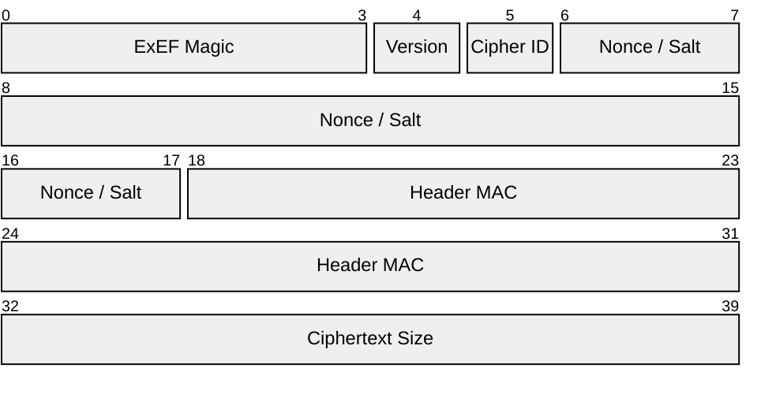

# Excalibur Encryption Format (ExEF)

All traffic and files will be encrypted using the Excalibur Encryption Format (ExEF). Files with a file extension of `.exef` will use the Excalibur Encryption Format.

This document describes ExEF version 3.

## Structure

An ExEF file composes three main parts: a fixed-size header, the variable-length ciphertext, and a fixed-size footer.

| Part           | Size (Bytes) | Description                                      |
| :------------- | :----------- | :----------------------------------------------- |
| **Header**     | 40           | Metadata, nonce, and a MAC for key verification. |
| **Ciphertext** | Variable     | The encrypted data.                              |
| **Footer**     | 16           | The final AES-GCM authentication tag.            |

### Header

The following is a diagram of the ExEF header. The numbers represent 0-indexed byte positions.

The table below describes the fields present in the header. All multi-byte integers are stored in **Big-Endian** format (network byte order).

| Bytes   | Field Name          | Size (Bytes) | Description                                                                                                                         |
| :------ | :------------------ | :----------- | :---------------------------------------------------------------------------------------------------------------------------------- |
| `0-3`   | **ExEF Magic**      | 4            | The ASCII string `ExEF`.                                                                                                            |
| `4`     | **Version**         | 1            | `0x03` for this version.                                                                                                            |
| `5`     | **Cipher ID**       | 1            | A 1-byte identifier for the encryption algorithm. See table below.                                                                  |
| `6-17`  | **Nonce / Salt**    | 12           | The unique 12-byte nonce for AES-GCM, also used as the salt for HKDF. **Must be unique for each file encrypted with the same key.** |
| `18-31` | **Header MAC**      | 14           | The first 14 bytes of the full HMAC-SHA256 output. Used to quickly verify the master key.                                           |
| `32-39` | **Ciphertext Size** | 8            | The length of the ciphertext data in bytes. An 8-byte unsigned integer.                                                             |

The currently supported ciphers are listed below.

| ID     | Algorithm   | Key Size           |
| :----- | :---------- | :----------------- |
| `0x01` | AES-128-GCM | 128-bit (16 bytes) |
| `0x02` | AES-192-GCM | 192-bit (24 bytes) |
| `0x03` | AES-256-GCM | 256-bit (32 bytes) |

Details on the header MAC are provided [below](#header-mac-generation).

### Ciphertext

This section immediately follows the header. Its length is defined by the `Ciphertext Size` field in the header.

### Footer

This section immediately follows the ciphertext.

| Bytes  | Field Name | Size (Bytes) | Description                                                                |
| :----- | :--------- | :----------- | :------------------------------------------------------------------------- |
| `0-15` | **Tag**    | 16           | The 16-byte authentication tag produced by the AES-GCM encryption process. |

## Keys

We do not directly use the vault key ($K$) for encryption. Instead, two keys are derived from the vault key using HKDF.

- **Crypto Key ($k_c$)**: This key is the actual key used to encrypt/decrypt the ciphertext stored in an ExEF file.
- **MAC Key ($k_m$)**: This key is used as a quick check on the provided vault key $K$.

These two keys are generated using HKDF with the following parameters (following [Wikipedia's format](https://en.wikipedia.org/wiki/HKDF#Mechanism)):

- `salt`: the value of the `Nonce` field in the header.
- `IKM` (input key material): the vault key $K$.
- `info`: a string that depends on the key that we are generating. The string is converted into bytes using ASCII encoding.
    - If we are generating $k_c$, then it will be the string `ExEF Crypto Key`.
    - Otherwise, it will be the string `ExEF MAC Key`.
- `length`: the length of the vault key $K$.

## Header MAC Generation

The header MAC field in the header uses HMAC-SHA256 with the key $k_m$. The process for generating the header MAC is as follows.

1. The header is generated, except all bytes in the `Header MAC` field are set to null bytes.
2. Generate the HMAC of this header. Since we are using SHA256, this should be a 32-byte (256-bit) digest.
3. Extract the first 14 bytes of this digest. This is the `Header MAC` field.

:::important

The header MAC is not used for authentication. It is only used as a quick verification on the provided vault key $K$.

:::

:::tip

It is recommended to check the provided vault key $K$ using the header MAC. You can, of course, skip the verification of the header MAC, but this would lead to the (possibly incorrect) decryption of the entire ciphertext before discovering it is invalid via checking the footer tag.

:::

## Ciphertext Decryption

After verifying that the vault key $K$ is (likely) correct using the header MAC and the MAC key $k_m$, the crypto key $k_c$ is used to decrypt the ciphertext. Verification of the decryption is done using the footer tag.
