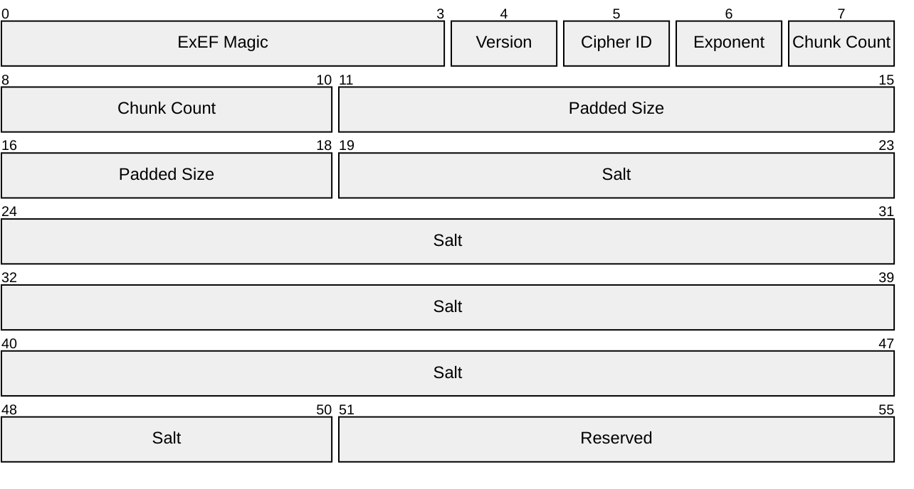

# ExEF v4

:::warning

This document is a draft and is subject to change.

:::

{/* :::important

This is the current version of the ExEF format.

::: */}

## Structure

An ExEF file composes two main parts: a fixed-size header and the variable-length body.

| Part           | Size (Bytes)             | Description                                              |
| :------------- | :----------------------- | :------------------------------------------------------- |
| **Header**     | 56                       | Metadata, framing parameters, and salt.                 |
| **Body**       | Variable                 | A sequence of `Chunk Count` encrypted and tagged chunks. |

### Header

The following is a diagram of the ExEF header. The numbers represent 0-indexed byte positions.

<div className="text-center">

</div>

The table below describes the fields present in the header. All multi-byte integers are stored in **Big-Endian** format (network byte order).

| Bytes   | Field Name              | Size (Bytes) | Description                                                                                                                        |
| :------ | :---------------------- | :----------- | :--------------------------------------------------------------------------------------------------------------------------------- |
| `0-3`   | **ExEF Magic**          | 4            | The ASCII string `ExEF`.                                                                                                            |
| `4`     | **Version**             | 1            | `0x04` for this version.                                                                                                            |
| `5`     | **Cipher ID**           | 1            | A 1-byte identifier for the encryption algorithm. See table below.                                                                  |
| `6`     | **Chunk Size Exponent**, $E$ | 1            | A 1-byte unsigned integer representing the base-2 exponent of the chunk size. Note that the plaintext chunk size is $C = 2^E$ bytes. **Must** satisfy $12 \leq E \leq 30$ (4 KiB to 1 GiB).                        |
| `7-10` | **Chunk Count**, $N$         | 4            | The number of chunks in the body as a 4-byte unsigned integer. **Must** be at least 1.                                        |
| `11-18` | **Padded Size**, $L_p$ | 8            | The total number of *plaintext* bytes across all chunks, as an 8-byte unsigned integer. This includes the encrypted length prefix and padding, but **not** the per-chunk tags. |
| `19-50` | **Salt**                | 32           | A 32-byte cryptographically random salt, used as the HKDF salt. **Must be freshly generated for every file.**                       |
| `51-55` | **Reserved**            | 5            | Must be zero.                                                                                                                       |


#### Ciphers

| ID            | Algorithm   | Key Size            |
| :------------ | :---------- | :------------------ |
| `0x01`        | AES-128-GCM | 128 bits (16 bytes) |
| `0x02`        | AES-192-GCM | 192 bits (24 bytes) |
| `0x03`        | AES-256-GCM | 256 bits (32 bytes) |
| `0x04`-`0xFF` | *Reserved*  | N/A                 |

An implementation encountering an unknown `Version` or `Cipher ID` **must fail closed** and reject.

:::note[Reserved Bytes]

The 5 reserved bytes at offsets `51-55` are the format's forward-compatibility mechanism: they **must** be zero in this version, and a reader **must** reject any file in which they are non-zero. A future revision may assign meaning to them.

:::

### Body {/* #body */}

This section immediately follows the header. It consists of exactly `Chunk Count` chunks, laid out back to back with no separators or alignment.

#### Pre-Encryption Plaintext {/* #pre-encryption-plaintext */}

The plaintext stream is constructed first before being split into chunks. The table below describes the fields present in the pre-encryption plaintext. All multi-byte integers are stored in **Big-Endian** format (network byte order).

| Field Name          | Size (Bytes) | Description                                                              |
| :------------------ | :----------- | :----------------------------------------------------------------------- |
| **Plaintext Size**, $L$  | 8            | Length of the plaintext data in bytes, as an 8-byte unsigned integer.    |
| **Plaintext**       | Variable     | Data to be encrypted.                                                    |
| **PADME Padding**   | Variable     | The PADME padding to reduce information leakage through length analysis. |

In particular, given a plaintext $P$ of length $L$ bytes, the pre-encryption plaintext is constructed as follows:

```
pre_encryption_plaintext = uint64_be(L) || P || 0x00 * (PADME(L) - L)
```

where `uint64_be(L)` represents the 8-byte big-endian representation of $L$, `||` represents concatenation, and `*` represents repetition. See [Padding](#padding) for the definition of the `PADME()` function. It is worth noting that the `Padded Size` field, $L_p$, is exactly the length of `pre_encryption_plaintext`, so $L_p = 8 + \mathrm{PADME}(L)$.

#### Chunking

With `pre_encryption_plaintext` generated, it is then split into chunks of exactly $C = 2^E$ bytes, with the final chunk holding the remainder. In particular, the number of chunks for a `Padded Size` of $L_p$ is

$$
N = \left\lceil \frac{L_p}{C} \right\rceil
$$

Chunks are 0-indexed. Chunks $0$ through $N-2$ are each exactly $C$ bytes of plaintext. Chunk $N-1$ is between 1 and $C$ bytes. Because the padded size $L_p$ is at least 8 (it always contains the `Plaintext Size` field), $N \geq 1$. A decryptor **must** reject any file whose `Chunk Count` disagrees with the formula above.
 
Each chunk $i$ is then generated by the [authenticated encryption process](#authenticated-encryption) described below. Since each of the $N$ chunks carries a 16-byte tag, the final size of the body is $L_p + 16N$.

### Size Limits {/* #size-limits */}

AES-GCM permits at most $2^{39} - 256$ bits (approximately 64 GiB) of plaintext per `(key, nonce)` pair, as described in [NIST SP 800-38D, Section 5.2.1.1](https://nvlpubs.nist.gov/nistpubs/Legacy/SP/nistspecialpublication800-38d.pdf). Because the chunk size is capped at $C = 2^{30}$ bytes (1 GiB) by the $E \leq 30$ requirement, no single chunk can approach this bound, and it therefore _imposes no practical constraint on the file size as a whole_.

The remaining limits are structural:

- `Chunk Count` is a 4-byte field, so $1 \leq N \leq 2^{32} - 1$.
- `Padded Size` **must** satisfy $8 \leq L_p \leq 2^{64}-1$, and an implementation **must** reject any file where $\lceil \frac{L_p}{C} \rceil \neq N$ or where that quotient would exceed $2^{32} - 1$. The limit of $L_p \geq 8$ is explained in [Padding](#padding).

## Padding {/* #padding */}

The plaintext is padded using **PADME** ([Nikitin, Barman et al., 2019](https://arxiv.org/pdf/1806.03160v4)), which bounds the padding overhead to a small fraction of the file size while collapsing file lengths into a limited number of buckets.

`PADME(L)` is defined as follows:

```python
def padme(L: int) -> int:
    if L < 2:
        return L
    E = L.bit_length() - 1               # L's floating-point exponent
    S = E.bit_length()                   # Number of bits to represent E
    last_bits = E - S                    # Number of low bits to set to 0
    bit_mask = (1 << last_bits) - 1      # Mask of `last_bits` 1s in LSB
    return (L + bit_mask) & ~bit_mask    # Clear last `last_bits` bits
```

Observe that `PADME(0) = 0`, and thus the minimum `Padded Size` $L_p$ is 8 (consisting only of the 8-byte `Plaintext Size` field). One also observes that PADME is idempotent, i.e.
$$
\mathrm{PADME}(\mathrm{PADME}(L)) = \mathrm{PADME}(L)
$$
for all $L$. Valid $L_p - 8$ values are therefore exactly the fixed points of PADME.

The reference implementation in Python uses arbitrary-precision integers. Do note that, in a fixed-width implementation, `L + bit_mask` can overflow for any $L$ near $2^{64}$ (for example, $L = 2^{64} - 1$). Callers **must** check that the value of $L$ does not cause an overflow; in particular, if $\mathrm{PADME}(L)$ is less than $L$, the addition overflowed, so reject it.

:::note[What PADME Does Not Hide]

PADME reduces, but does not eliminate, length leakage: it leaks roughly $\log_2 (\log_2 L)$ bits about $L$. Combined with the `ExEF` magic bytes and the fixed overhead, an ExEF file remains identifiable as an ExEF file of approximately known size. In fact, $\mathrm{PADME}(L)$ is $L_p - 8$, and $L_p$ is carried in the header in the clear. Callers requiring stronger length hiding must pad at a higher layer.

In addition, because the chunk exponent is in the header, we can infer the chunk size from the file. Implementations **should** use a single fixed `Chunk Size Exponent` rather than tuning it per file, so that $E$ does not become a fingerprint of the writing application or of the data.

:::

Once the padded length is determined, we can add padding to the plaintext. The padding bytes are zero. They are inside the AEAD, so they are neither distinguishable nor malleable.

## Keys

We do not directly use the vault key ($K$) for encrypting data. Instead, a **crypto key $k_c$** is derived from the vault key. This key is the actual key used to encrypt/decrypt the data stored in an ExEF file.

The crypto key is generated using **HKDF-SHA256** with the following parameters (following [Wikipedia's format](https://en.wikipedia.org/wiki/HKDF#Mechanism)):

- `salt`: the 32-byte value of the `Salt` field in the header.
- `IKM` (input key material): the vault key $K$.
- `info`: the ASCII-encoded string `ExEF v4 Crypto Key`, followed by the single `Cipher ID` byte.
- `length`: the key size required by the `Cipher ID` (16, 24, or 32 bytes).

For other uses of ExEF, the vault key $K$ is replaced with a context-appropriate key. For example, during end-to-end transmission of data, the end-to-end encryption session key is used instead.

:::caution[The Vault Key Must Come from a Slow KDF]

Possession of an ExEF file lets an attacker test a guess of the vault key $K$ entirely offline: derive $k_c$ from the guess and the (public) `Salt`, then check whether the first chunk's AES-GCM tag verifies. A correct guess verifies; a wrong one does not. The file is therefore a self-contained password-cracking oracle. So if $K$ is derived from a user password, that derivation **must** use a memory-hard KDF (e.g. Argon2d or Argon2id) with appropriate parameters.

:::

## Authenticated Encryption {/* #authenticated-encryption */}

We use AES-GCM to produce authenticated encryption of the data. AES-GCM is invoked **once per chunk**, with the following parameters:

| Parameter | Value                                                                                            |
| :-------- | :----------------------------------------------------------------------------------------------- |
| Key       | $k_c$ (the same for every chunk in a file)                                                        |
| Nonce     | `nonce(i)`; see [Nonce](#gcm-nonce) below                                               |
| AAD       | `aad(i, is_final)`; see [Chunk AAD](#chunk-aad) below                                             |
| Plaintext | The $i$-th chunk of `pre_encryption_plaintext`; see [Body](#body)                                         |

### Nonce {/* #gcm-nonce */}

The 12-byte nonce for chunk $i$ is:

```
nonce(i) = 0x00 * 8 || uint32_be(i)
```

That is: 8 zero bytes followed by a 4-byte big-endian chunk index counting from 0.

The index used to build the nonce **must** be the decryptor's own position counter, derived by counting chunks from the start of the body. It is never read from the file.

:::danger[The Salt Must Be Unique]

The ExEF `Salt` field **must** be generated from a cryptographically secure random number generator, and **must never be reused** across files under the same vault key. Reusing a salt reuses $k_c$ and, with it, the *entire nonce sequence* $0, 1, \dots$, which is catastrophic for AES-GCM.

:::

<details>
  <summary>Why is the nonce unique?</summary>

  Nonce uniqueness holds because:

    1. Within a file, the chunk index $i$ is distinct for every chunk, so no nonce repeats under $k_c$.
    2. Across files, $k_c$ itself is fresh, because it is derived from a fresh 32-byte random salt. The (key, nonce) pair is therefore unique whenever the salt is unique, and a 32-byte salt makes collisions negligible.
</details>


### Chunk AAD {/* #chunk-aad */}

The additional authenticated data for chunk $i$ is:

```
aad(i, is_final) = header || uint32_be(i) || (0x01 if is_final else 0x00)
```

where `header` is the complete 56-byte header and `is_final` is true for the final chunk and false otherwise.

Because the header is in every chunk's AAD, the `Version`, `Cipher ID`, `Chunk Size Exponent`, `Chunk Count`, `Padded Size`, `Salt`, and reserved fields are all cryptographically bound to every chunk, and any modification to them causes tag verification to fail. In particular, binding `Chunk Count` and `Padded Size` allows a decryptor that has verified chunk 0 to know, authentically, how many chunks and how many plaintext bytes must follow.

:::note[Why the final-chunk marker exists]

The `is_final` marker is technically redundant, since the `Chunk Count` is part of the header which is already in the AAD. However, it serves as a backup for a streaming decryptor that has (unwisely) not retained the header state to still refuse to terminate on a non-final chunk.

:::

## Cryptographic Processes
### Encryption

We assume that an encryptor knows the full plaintext length $L$ before proceeding with encryption.

1. Compute the padded size $L_p = 8 + \mathrm{PADME}(L)$. Reject if $L_p$ exceeds the [size limits](#size-limits) (i.e. if $L_p > 2^{64}-1$).
2. Choose the chunk size exponent $E$ (with $12 \leq E \leq 30$), let $C = 2^E$, and compute $N = \lceil \frac{L_p}{C} \rceil$. Reject if $N \geq 2^{32}$.
3. Generate a fresh 32-byte random `Salt` using a cryptographically secure random generator.
4. Using $K$ and the `Salt`, derive the crypto key $k_c$.
5. Build the pre-encryption plaintext [as described above](#pre-encryption-plaintext).
6. Fill in the header, setting `Chunk Size Exponent` to $E$, `Chunk Count` to $N$, `Padded Size` to $L_p$, and the reserved bytes to zero.
7. For each $i$ from 0 to $N - 1$: take the next $\min(C, \text{remaining})$ bytes of the pre-encryption plaintext and encrypt them with AES-GCM using $k_c$, `nonce(i)`, and `aad(i, i == N-1)`. Append the ciphertext followed by the 16-byte tag.
8. Concatenate the header and the chunks.

### Decryption

1. Read the 56-byte header. Reject if the magic, version, or cipher ID is unrecognised, or if any reserved byte is non-zero.
2. From the header, obtain the chunk size exponent $E$ and chunk count $N$. Assert $12 \leq E \leq 30$, $8 \leq L_p \leq 2^{64}-1$, $\mathrm{PADME}(L_p - 8) = L_p - 8$, $N \geq 1$, $N = \lceil \frac{L_p}{C} \rceil$, _in that order_. Reject on any mismatch.
   - If the total size is known in advance (i.e. the input is a seekable file rather than a stream), also assert that the total size is $56 + L_p + 16N$.
   - Note that a streaming decryptor cannot perform this check up front and instead enforces it at end-of-file, via steps 5 and 6.
3. Reject if $L_p - 8$ exceeds the caller's policy limit on plaintext size. This check uses caller policy, **not** the header, to decide what is acceptable. A decryptor **should** likewise cap the acceptable chunk size exponent $E$ by policy, since $E$ is attacker-supplied and is only authenticated once chunk 0 verifies.
   - For example, an unchecked $E = 30$ forces a 1 GiB working buffer before any tag has been checked.
4. Using $K$ and the salt in the header, derive the crypto key $k_c$.
5. For $i$ from 0 to $N-1$:
    1. Let `is_final = (i == N - 1)` and let $c_i$ be the expected plaintext length of this chunk: $C$ for all but the last chunk, and $L_p - (N-1) \times C$ for the last. Both are known from the header, which is authenticated by the tag of every chunk.
    2. Read exactly $c_i$ ciphertext bytes followed by exactly 16 tag bytes. Reject if the input ends early.
    3. Decrypt with AES-GCM using $k_c$, `nonce(i)`, and `aad(i, is_final)`, where $i$ is the decryptor's own counter, **never a value read from the file**.
    4. Verify the tag and reject on mismatch; do not attempt to resynchronise or skip to the next chunk. Do not act on any byte of chunk $i$ before its tag has verified. See the warning below for what may be done afterwards.
6. Reject if any bytes remain after the last chunk's tag.
7. Read the 8-byte `Plaintext Size` prefix (i.e., the first 8 bytes of chunk 0's plaintext) of the decrypted pre-encryption plaintext. Reject if `Plaintext Size > Padded Size - 8`, or if `PADME(Plaintext Size) != Padded Size - 8`.
8. Verify that the `Padded Size - 8 - Plaintext Size` trailing padding bytes are all zero; reject otherwise.
    - Note that this is not a security check, as the padding is already authenticated. This just enforces a canonical encoding.
9. The plaintext is the `Plaintext Size` bytes following the length prefix.

A decryptor should **not** use a working buffer larger than $C$ plus the 16-byte tag, regardless of `Padded Size`. Memory usage is therefore bounded by the *chunk size*, which is a small, validated constant, rather than by an attacker-controlled 64-bit field.

:::caution[Streaming Decryptors Must Fail Loud]

If an implementation streams plaintext to a consumer before the final chunk is verified, then:

- It **must** propagate a truncation error to the consumer in a way that cannot be mistaken for a clean end of stream. Closing the pipe, returning EOF, or returning a short read is not acceptable.
- Its API **must** make clear that output is provisional until the stream completes successfully, so that callers know not to commit, publish, or act irreversibly on a prefix.
- Where the consumer cannot tolerate a truncated prefix, it **must** buffer the full plaintext (or write to a temporary location and commit atomically on success) rather than streaming it.

The 8-byte `Plaintext Size` prefix remains at the front of chunk 0 precisely so that a streaming implementation can size its output correctly from the first verified chunk. It tells you how long the file *claims* to be; only reaching the verified final chunk tells you that you got all of it.

:::
