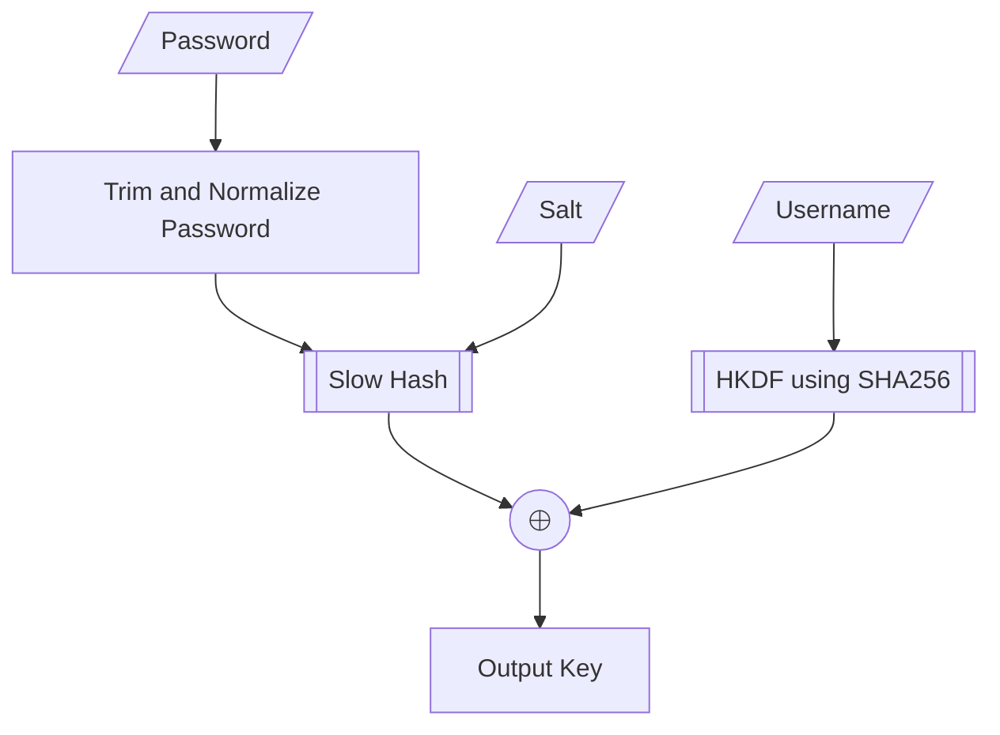

# Account Unlock Key (AUK) Generation

This document describes the AUK generation process used in Excalibur, which is based on 1Password's key generation process as described in [their security whitepaper](https://1passwordstatic.com/files/security/1password-white-paper.pdf).

The key generation process can be concisely summarized in the following flowchart.

Let's examine each step in detail.

1. **Password Normalization**
    1. Trim leading/trailing whitespace from the password
    2. Apply Unicode NFKD normalization to handle different character encodings
    3. Convert the normalized password to a UTF-8 byte array

2. **Slow Hash**: produces a 32-byte string
    - Option 1 (Preferred): Argon2d v1.3
        - Parameters: `m = 32768`, `t = 3`, `p = 2` (see https://www.dashlane.com/download/whitepaper-en.pdf, page 40)
    - Option 2 (Compatibility): 650,000 iterations of PBKDF2 with HMAC-SHA256

3. **Fast Hash (HKDF)**
    - Algorithm: HKDF with SHA-256
    - Input: Username (as additional info) + Salt
    - Output: 32-byte derived key

4. **Key Combination**
    - The final master key is generated by XORing the outputs of the PBKDF2 and HKDF operations

This key generation step is used to generate a key for decrypting the encrypted vault key, called the **Account Unlock Key** (AUK).
