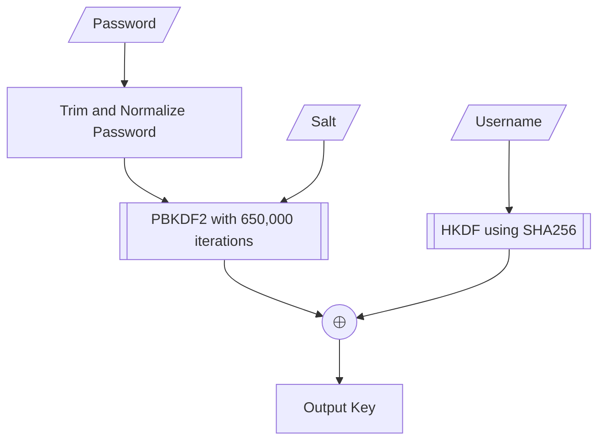

# Network Key Generation

This document describes the network key generation process used in Excalibur, which is based on 1Password's key generation process as described in [their security whitepaper](https://1passwordstatic.com/files/security/1password-white-paper.pdf).

The key generation process can be concisely summarized in the following flowchart.

Let's examine each step in detail.

1. **Password Normalization**
    1. Trim leading/trailing whitespace from the password
    2. Apply Unicode NFKD normalization to handle different character encodings
    3. Convert the normalized password to a UTF-8 byte array

2. **Slow Hash (PBKDF2)**
    - Algorithm: PBKDF2 with HMAC-SHA256
    - Iterations: 650,000
    - Input: Normalized password + Salt
    - Output: 32-byte derived key

3. **Fast Hash (HKDF)**
    - Algorithm: HKDF with SHA-256
    - Input: Username (as additional info) + Salt
    - Output: 32-byte derived key

4. **Key Combination**
    - The final master key is generated by XORing the outputs of the PBKDF2 and HKDF operations

This key generation step is used to generate a key for unlocking the vault[^vault-key], called the **Account Unlock Key** (AUK), using a salt called `auk_salt`.

[^vault-key]: More accurately, the key is actually used to decrypt the file that contains the vault key.

:::note[Secure Remote Password (SRP)]

If a user uses [SRP authentication](./server-api/authentication.mdx), the same key generation step is used to generate a key for SRP authentication, called the **SRP Key**, using a salt called `srp_salt`.

The reason for why we need a second key is that we don't want a leak of the communication key (i.e., the SRP key) to compromise the vault, and vice versa. Thus the two salts, `auk_salt` and `srp_salt`, are distinct.

:::
