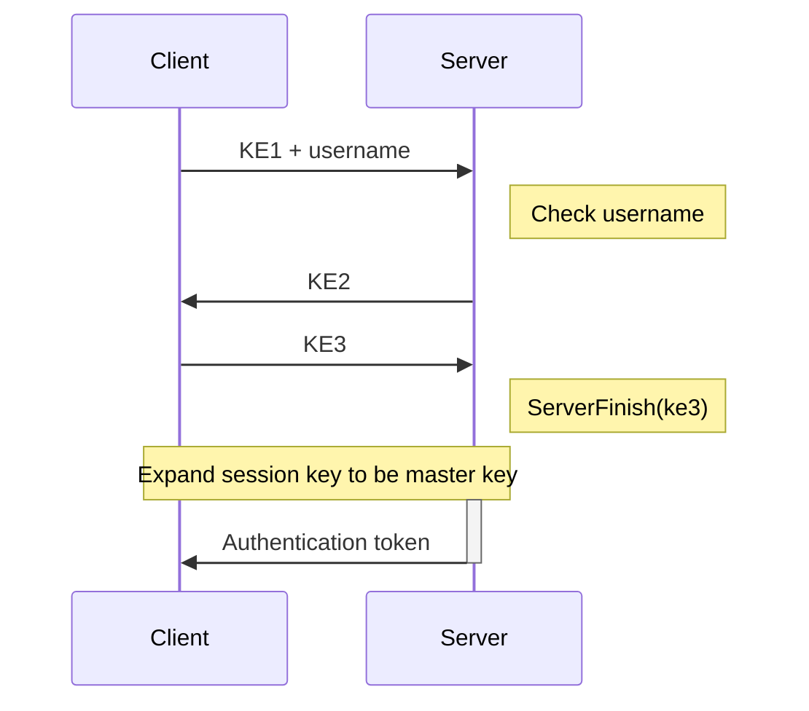
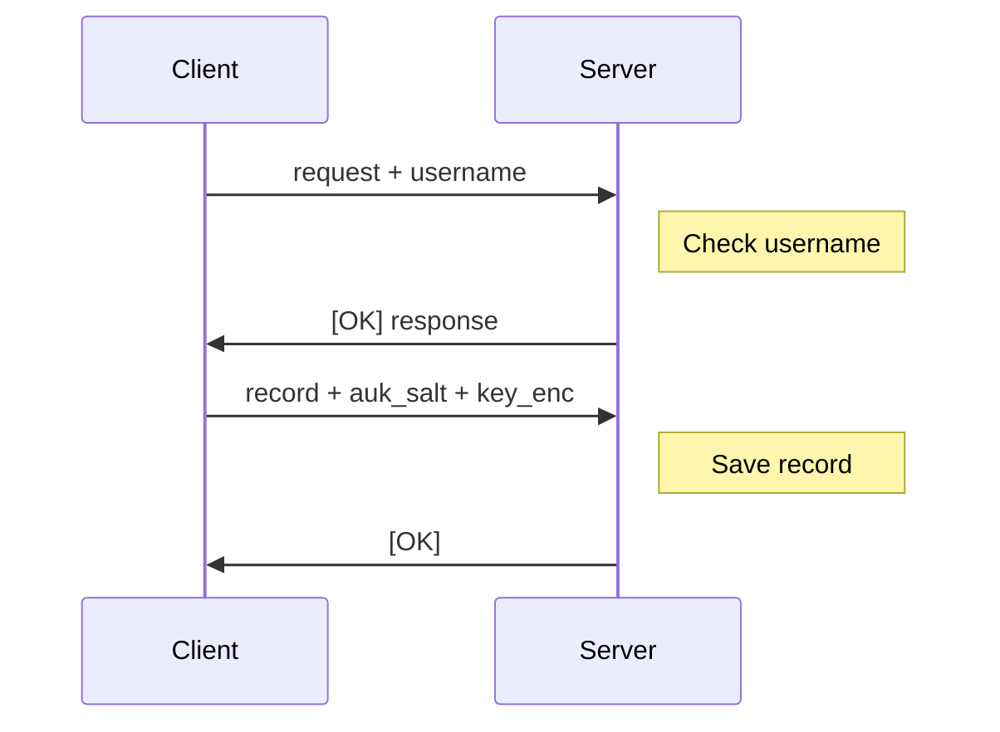

# Initial Authentication via OPAQUE-3DH

The OPAQUE-3DH protocol is a modern augmented password-authenticated key exchange (aPAKE) protocol that supports bilateral authentication of both the client and the server, as well as providing forward secrecy and the ability to hide the password from the server, even during registration.

The full OPAQUE-3DH process is described in [RFC9807](https://datatracker.ietf.org/doc/html/rfc9807). Excalibur's implementation requires referencing [RFC9496 (`ristretto255` Elliptic Curve Group)](https://datatracker.ietf.org/doc/html/rfc9496#name-ristretto255) and [RFC9497 (Oblivious PRFs)](https://datatracker.ietf.org/doc/html/rfc9497).

## Message Format

Each message is a JSON object containing the following fields:

- `status`: Current authentication status. Can be `OK`, `ERR`, or null.
- `binary`: Whether the included data is binary data. Can be `true` or `false`.
- `data`: Message data. If `binary` is true, this field is a Base64 encoded byte array. Otherwise, it is a ASCII string.

Here are two examples of messages:


```json
{
    "status": null,
    "binary": true,
    "data": "AQ=="
}
```

```json
{
    "status": "OK",
    "binary": false,
    "data": "Sample Text"
}
```

Do note that most of the OPAQUE messages are binary data. The only non-binary data that will be sent is the final authentication token.

## Login

The initial authentication process uses a [WebSocket](https://en.wikipedia.org/wiki/WebSocket) connection to the `/api/auth/opaque` endpoint. The rough process is as follows:

<div className="text-center">



</div>

There are some deviations from the aforementioned RFC, as noted below.

### `KE1 + username` Message
In RFC9807, the username is sent as part of the `KE1` message. However the server still has to have a way to obtain the username in order to check it and to generate `KE2`.

To achieve this, we **concatenate the username after the `KE1` message** and send both to the server together. The server then extracts the username from the message and uses it to check if the user exists and to generate `KE2`.

### Master Key

We derive the master key from the shared session key using:
```
HKDF-Expand(session_key, b"Master Key", 32)
```

where the `HKDF-Expand` function is as described in [RFC5869, Section 2.3](https://datatracker.ietf.org/doc/html/rfc5869#section-2.3).

### Authentication Token

The server will send a message with no status and JSON data containing three fields: `nonce`, `token`, and `tag`, each as a Base64 encoded byte array:
- `nonce`: A random value
- `token`: An encrypted JSON Web Token (JWT) using AES-GCM-256 with the key being the derived master key
- `tag`: The authentication tag for the encrypted token

## Registration

The OPAQUE-3DH protocol differs from the legacy [Secure Remote Password (SRP)](./srp) protocol by requiring a WebSocket connection to the `/api/auth/opaque/register` endpoint. The rough process is as follows:

<div className="text-center">



</div>

There are some deviations from the aforementioned RFC, as noted below.

### `request + username` Message
Like with the login flow, we need to send the username to the server. Thus we **concatenate the username after the registration `request` message** and send both to the server together. The server then extracts the username from the message and uses it to check if the user exists and to generate the appropriate response.

### `record + auk_salt + key_enc` Message

As the server needs to store the encrypted vault key, we need a way to send the [Account Unlock Key (AUK)](../../keygen.mdx) salt (`auk_salt`) and the encrypted vault key (`key_enc`) to the server. We do this by **concatenating the `record`, `auk_salt`, and `key_enc` fields** and sending them to the server together. Do note that `auk_salt` must be 32-bytes in length.

## Official Implementations

- The implementation of the OPAQUE login protocol can be found in the [`opaque/login.py` file](https://github.com/PhotonicGluon/Excalibur/blob/main/server/excalibur_server/api/routes/auth/comms/opaque/login.py).
- The implementation of the OPAQUE registration protocol can be found in the [`opaque/register.py` file](https://github.com/PhotonicGluon/Excalibur/blob/main/server/excalibur_server/api/routes/auth/comms/opaque/register.py).
