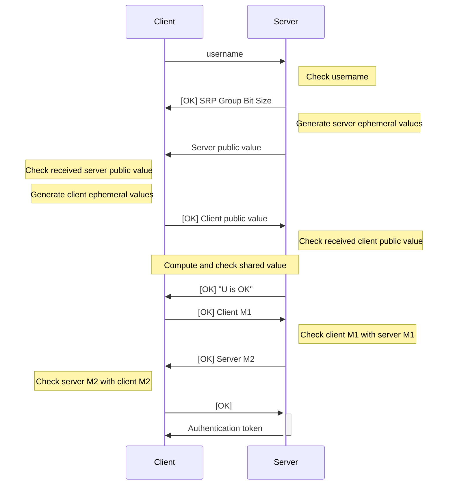

# Initial Authentication via Secure Remote Password (SRP)

:::warning

Initial authentication via the SRP protocol will be deprecated in a future release. Existing users are advised to migrate to the new [OPAQUE-3DH](./opaque) aPAKE protocol.

:::

The initial authentication process uses a [WebSocket](https://en.wikipedia.org/wiki/WebSocket) connection to the `/api/auth` endpoint. The rough process is as follows:

<div className="text-center">



</div>

Let us examine the process in more detail.

## Message Format

Each message is a JSON object containing the following fields:

- `status`: Current authentication status. Can be `OK`, `ERR`, or null.
- `binary`: Whether the included data is binary data. Can be `true` or `false`.
- `data`: Message data. If `binary` is true, this field is a Base64 encoded byte array. Otherwise, it is a ASCII string.

Here are two examples of messages:

```json
{
    "status": "OK",
    "binary": false,
    "data": "U is OK"
}
```

```json
{
    "status": null,
    "binary": true,
    "data": "AQ=="
}
```

## Specification

The specification of how the authentication process works is very technical and is described below.

Let

- $N$ denote the SRP prime according to [RFC5054, Appendix A](https://datatracker.ietf.org/doc/html/rfc5054#appendix-A);
- $g$ denote the SRP generator according to [RFC5054, Appendix A](https://datatracker.ietf.org/doc/html/rfc5054#appendix-A);
- $k$ denote the SRP multiplier according to [RFC5054, Section 2.6](https://datatracker.ietf.org/doc/html/rfc5054#section-2.6);
- $x$ denote the SRP-$x$ key generated on the client-side; and
- $v = g^x \mod N$ be the verifier value.

:::danger

$x$ and $v$ should be treated as secrets. The server should **never** have access to $x$, and no one other than the server and client should have access to $v$.

:::

The initial authentication process is as follows:

1. Client sends its username to the server.
2. Server checks whether it has a record of the requested username.
    - If username is not found, server sends message with status `ERR` and data `User does not exist`. Terminate connection.
3. Server sends message with status `OK` and the SRP group size (in bits) as an ASCII string (e.g., `1024`).
4. Server generates its ephemeral values (private value $b$ and public value $B = (kv + g^b) \mod N$) and sends the public value $B$ to the client (specifying `binary = true`).
5. Client checks the received $B$.
    - If $B$ is invalid (e.g., $B \mod N = 0$), client sends message with status `ERR` (data can be anything). Client can choose to terminate the connection, or wait for server to try another $B$.
6. Client generates its ephemeral values (private value $a$ and public value $A = g^a \mod N$) and sends the public value $A$ to the server (specifying `binary = true`) with status `OK`.
7. Server checks received $A$.
    - If $A$ is invalid (e.g., $A \mod N = 0$), sends message with status `ERR` (data can be anything). Server can choose to terminate the connection, or wait for client to try another $A$.
8. Both client and server computes $u = \texttt{SHA1}(A || B)$ where $||$ refers to concatenation. Note that $A$ and $B$ have been padded to SRP group size bits using zero padding on the left.
    - If server detects $u \equiv 0 \pmod N$, it sends message with status `ERR` and data `Shared U value is 0` and then terminates the connection.
    - If client detects $u \equiv 0 \pmod N$, it can just choose to close the connection.
9. Server sends message with status `OK` and data `U is OK`.
10. Client and server each computes their premaster value:
    - Client: $\texttt{pre}K = (B - kg^x)^{a + ux} \mod N$
    - Server: $\texttt{pre}K = (Av^u)^b \mod N$

    The master $K$ is computed by computing SHA3-256 of the premaster, padded to the SRP group size bits using zero padding.

11. Client computes $M_1 = H((H(N) \oplus H(g)) \; || \; \texttt{username} \; || \; \texttt{salt} \; || \; A \; || \; B \; || \; K_{\texttt{client}})$, where $\oplus$ means XOR and $H$ is SHA3-256.
12. Client sends $M_1$ to the server (setting `binary = true`) with status `OK`.
13. Server computes its own $M_1$ value using the same formula (using $K_{\texttt{server}}$ in place of $K_{\texttt{client}}$), and checks with the received $M_1$.
    - If they do not match, sends message with status `ERR` and data `M1 values do not match`, terminating the connection.
14. Server computes $M_2 = H(A \; || \; M_1 \; || \; K_{\texttt{server}})$, where $\oplus$ means XOR and $H$ is SHA3-256.
15. Server sends $M_2$ to the client (setting `binary = true`) with status `OK`.
16. Client computes its own $M_2$ value using the same formula (using $K_{\texttt{client}}$ in place of $K_{\texttt{server}}$), and checks with the received $M_2$.
    - If they do not match, client terminates the connection.
17. Client sends message with status `OK` with no data.
18. Server prepares [authentication token](#authentication-token) in the form of a JSON Web Token (JWT) and encrypts it with the shared master key $K$ using AES-GCM-256.
19. Server sends message with no status and JSON data containing three fields: `nonce`, `token`, and `tag`, each as a Base64 encoded byte array:
    - `nonce`: A random value
    - `token`: The encrypted JWT
    - `tag`: The authentication tag
20. Both sides close the connection.

:::note

The full code that implements the server-side checking can be found in the [`comms.py` file](https://github.com/PhotonicGluon/Excalibur/blob/main/server/excalibur_server/api/routes/auth/comms.py).

:::
