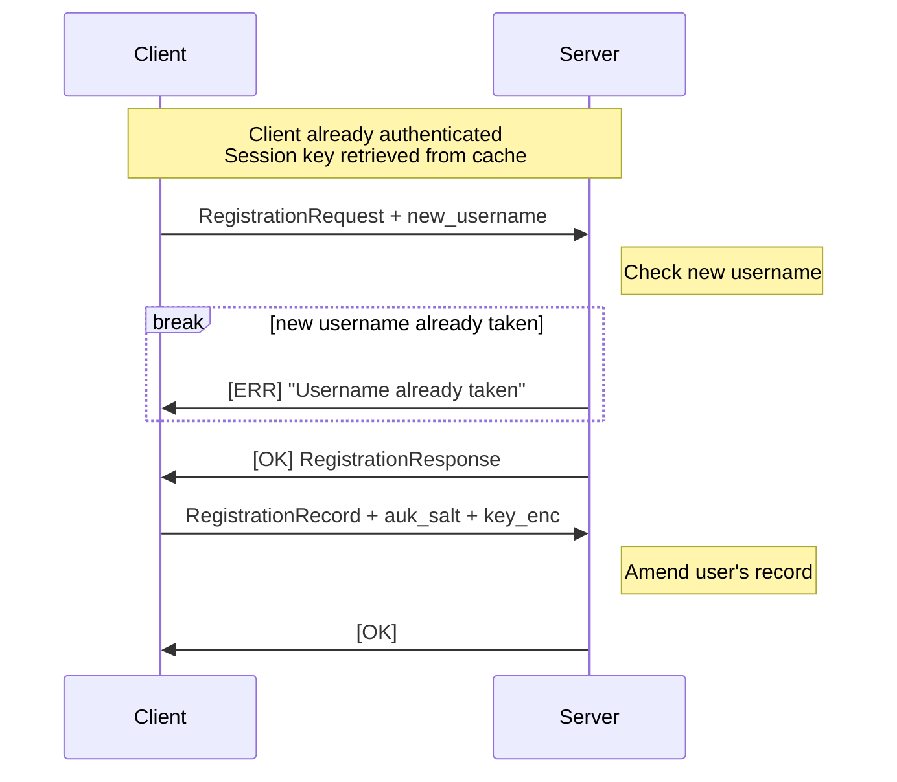

# Editing the OPAQUE-3DH Record

Sometimes, a user may want to change their username, password, or other details associated with their account. This endpoint allows the client to edit the user's record in the server's database.

Editing a user's record uses a [WebSocket](https://en.wikipedia.org/wiki/WebSocket) connection to the `/api/auth/opaque/edit-record` endpoint. Note that this endpoint requires the client to already be authenticated (see [Subsequent Authentication](../subsequent-authentication.mdx)). In particular, the client needs to provide a JWT token and a proof-of-possession (PoP) token as query parameters on the WebSocket request. The server then looks up the master key derived during that login (keyed by the `uuid` claim in the client's JWT) and uses it to encrypt the WebSocket messages exchanged below.

The rough record-editing process is as follows:

## Authentication

Since this endpoint amends an existing user's record, the client needs to already be authenticated with the server. In particular, the client must know the master key that was derived and cached when the user originally logged in as well as the authentication token. Then the client can follow the [WebSocket PoP token generation process](../subsequent-authentication.mdx#ws-pop) to generate an appropriate request to the edit record endpoint.

## Editing The Record

The rest of the process re-runs the OPAQUE-3DH registration protocol described in [registration](./register.mdx#registration-steps), but against the user's existing account rather than creating a new one. Do note that if the new requested username is already taken, the server will respond with a message with status `ERR` and message `Username already taken`, then close the connection without generating a registration response.

Rather than creating a new user entry, the server updates the existing row for the authenticated user in place: the username, `RegistrationRecord`, `auk_salt`, and `key_enc` fields are all overwritten with the newly submitted values. Once the update is committed, the server responds with a message with status `OK` and an empty message body to confirm that the edit succeeded, and the connection is closed.

## Official Implementation

The implementation of the record-editing endpoint can be found in the [`opaque/edit_record.py` file](https://github.com/PhotonicGluon/Excalibur/blob/stable/server/excalibur_server/api/routes/auth/comms/opaque/edit_record.py).
