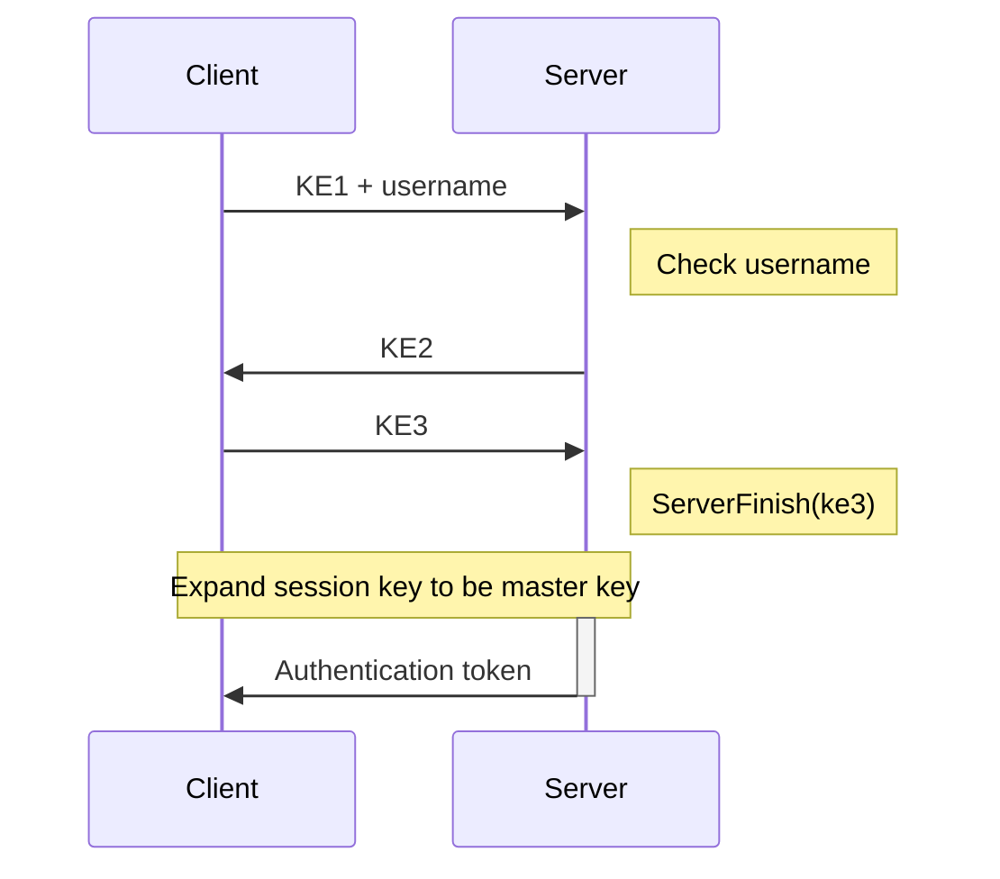

# Logging In via OPAQUE-3DH

Logging in uses a [WebSocket](https://en.wikipedia.org/wiki/WebSocket) connection to the `/api/auth/opaque` endpoint. The rough process is as follows:

<div className="text-center">



</div>

There are some deviations from the aforementioned RFC, as noted below.

## `KE1 + username` Message
In RFC9807, the username is not part of the `KE1` message. However the server still has to have a way to obtain the username in order to check it and to generate `KE2`.

To achieve this, we **concatenate the username after the `KE1` message** and send both to the server together (as described in section 10.3 of the RFC). The server then extracts the username from the message and uses it to check if the user exists and to generate `KE2`.

## Master Key

We derive the master key from the shared session key using:
```
HKDF-Expand(session_key, b"Master Key", 32)
```

where the `HKDF-Expand` function is as described in [RFC5869, Section 2.3](https://datatracker.ietf.org/doc/html/rfc5869#section-2.3).

## Authentication Token

The server will send a message with no status and JSON data containing three fields: `nonce`, `token`, and `tag`, each as a Base64 encoded byte array:
- **`nonce`**: A random value
- **`token`**: An encrypted JSON Web Token (JWT) using AES-GCM-256 with the key being the derived master key
- **`tag`**: The authentication tag for the encrypted token

## Official Implementation

The implementation of the OPAQUE login protocol can be found in the [`opaque/login.py` file](https://github.com/PhotonicGluon/Excalibur/blob/stable/server/excalibur_server/api/routes/auth/comms/opaque/login.py).
