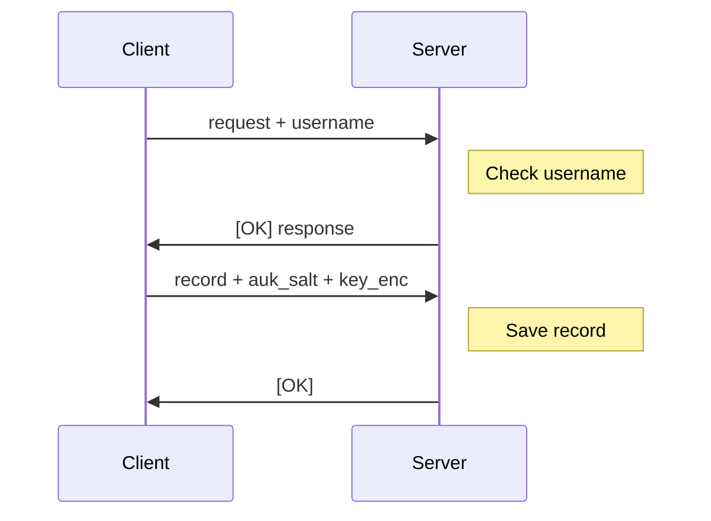

:::warning

This document is subject to change.

:::

# Registration via OPAQUE-3DH

Registration uses a [WebSocket](https://en.wikipedia.org/wiki/WebSocket) connection to the `/api/auth/opaque/register` endpoint. The rough process is as follows:

There are some deviations from the aforementioned RFC, as noted below.

## `request + username` Message
Like with the login flow, we need to send the username to the server. Thus we **concatenate the username after the registration `request` message** and send both to the server together (like in section 10.3 of the RFC). The server then extracts the username from the message and uses it to check if the user exists and to generate the appropriate response.

## `record + auk_salt + key_enc` Message

As the server needs to store the encrypted vault key, we need a way to send the [Account Unlock Key (AUK)](/docs/reference/keygen.mdx) salt (`auk_salt`) and the encrypted vault key (`key_enc`) to the server. We do this by **concatenating the `record`, `auk_salt`, and `key_enc` fields** and sending them to the server together. Do note that `auk_salt` must be 32-bytes in length.

## Official Implementation

The implementation of the OPAQUE registration protocol can be found in the [`opaque/registration.py` file](https://github.com/PhotonicGluon/Excalibur/blob/stable/server/excalibur_server/api/routes/auth/comms/opaque/registration.py).
