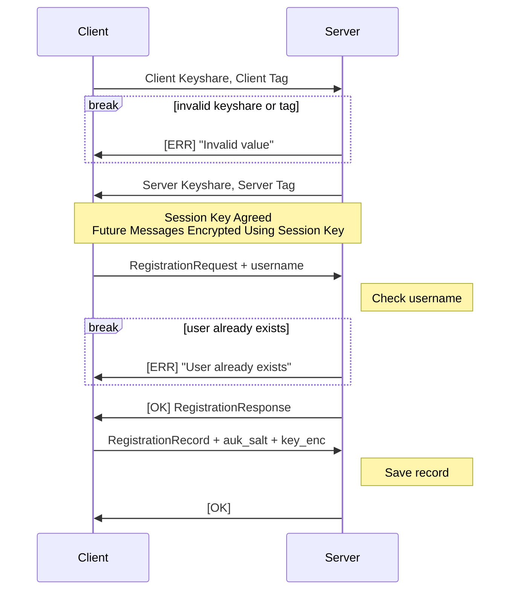
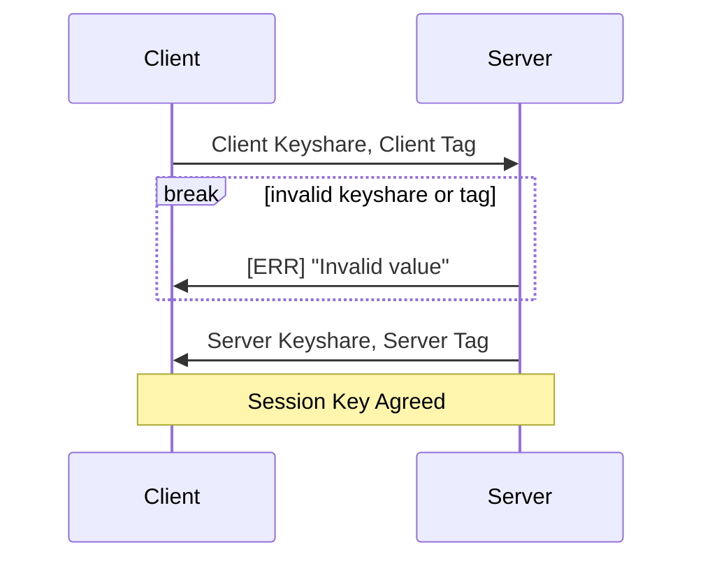
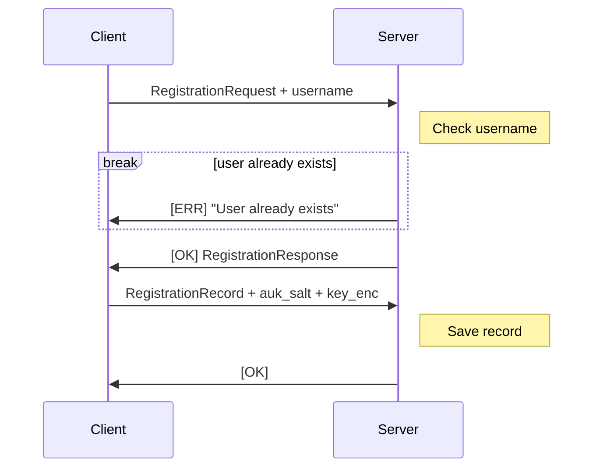

# Registration via Noise-NK and OPAQUE-3DH

Registration uses a [WebSocket](https://en.wikipedia.org/wiki/WebSocket) connection to the `/api/auth/opaque/register` endpoint. The whole process is roughly as follows:

There are two phases to the registration process:

- **Handshake Phase**: The client and server agrees upon a shared session key
- **Registration Phase**: The client and server perform the OPAQUE registration protocol within the encrypted channel using the session key

## Handshake Steps

The handshake step uses the Noise-NK protocol alongside the Ristretto255 elliptic curve, AES-GCM encryption, and SHA-256 hashing, and thus has the protocol name `Noise_NK_Ristretto255_AESGCM_SHA256`. It is assumed that the client has obtained the server's account creation public key before beginning the handshake. The rough handshake process is as follows:

Let us look at each step of the protocol. A fuller description of the Noise-NK protocol can be found in the [Noise Protocol Framework specification](https://noiseprotocol.org/noise.html#interactive-handshake-patterns-fundamental).

### `Client Keyshare, Client Tag` Message
The client begins the handshake by generating an ephemeral key pair and computing its public keyshare using the Ristretto255 group. Following the Noise "e, es" message pattern, the client:
- Mixes its public keyshare into the running handshake hash
- Performs a Diffie-Hellman between its ephemeral private key and the server's account creation public key, and uses the result to derive an encryption key via HKDF
- Uses that key to encrypt an empty plaintext, producing only an authentication tag

The client sends its public keyshare together with this tag to the server.

#### Invalid Keyshare or Tag
On the server, if the received keyshare cannot be decoded as a valid Ristretto255 point, or the tag fails to decrypt and verify against the key the server independently derives, the server aborts the handshake with an `ERR` status with message `Invalid value` and closes the connection. This guards against malformed or tampered handshake messages.

### `Server Keyshare, Server Tag` Message
Once the client's message is validated, the server performs the "e, ee" message pattern:
- It generates its own ephemeral key pair and mixes the resulting public keyshare into the handshake hash
- It performs a Diffie-Hellman between its ephemeral private key and the client's public keyshare, and derives a new encryption key from the result via HKDF
- It uses this key to encrypt an empty plaintext, producing its own authentication tag

The server responds with its public keyshare and tag.

### Session Key Agreement
The client verifies the server's tag by independently deriving the same "ee" encryption key from its ephemeral private key and the server's public keyshare. Once both sides have validated each other's tag, they each expand the final chaining key via HKDF to derive a shared session key. From this point onward, all further WebSocket messages exchanged between the client and server &mdash; including the entire OPAQUE registration exchange below &mdash; are encrypted using this session key.

## Registration Steps

The registration step follows the OPAQUE-3DH protocol. The rough registration process is as follows:

A fuller description of the OPAQUE-3DH registration process can be found in RFC9807.

### `RegistrationRequest + username` Message
Like with the login flow, we need to send the username to the server. Thus we **concatenate the username after the registration `request` message** and send both to the server together (like in section 10.3 of the RFC). Since `RegistrationRequest` is always of a fixed size, the server can split the incoming message at that boundary to recover the request and the username separately.

The server then uses the username to check whether an account already exists. If it does, the server responds with a message with status `ERR` and message `User already exists` and closes the connection _without generating a registration response_.

### `RegistrationResponse` Message
If the username is available, the server generates a `RegistrationResponse` from the client's `RegistrationRequest` using three pieces of server-side material:
- The server's static OPAQUE public key
- A per-user credential identifier (which is the username)
- The server's persistent OPRF seed, which is used (together with the credential identifier) to deterministically derive the per-user OPRF key

None of this material is derived from, or reveals anything about, the user's password. The response is sent back to the client with status `OK` and the content being the `RegistrationResponse` data. The client can use this together with the user's password to compute the final `RegistrationRecord`.

### `RegistrationRecord + auk_salt + key_enc` Message

As the server needs to store the encrypted vault key, we need a way to send the [Account Unlock Key (AUK)](/docs/reference/keygen.mdx) salt (`auk_salt`) and the encrypted vault key (`key_enc`) to the server. We do this by **concatenating the `record`, `auk_salt`, and `key_enc` fields** and sending them to the server together, with `RegistrationRecord` again being of a fixed, known size so the server can split the message accordingly. Do note that `auk_salt` must be 32-bytes in length.

#### Save Record
The server creates a new user entry containing the username, the chosen authentication protocol (`OPAQUE_3DH`), the `RegistrationRecord`, `auk_salt`, and `key_enc`, and persists it to the database. Once the record is saved, the server responds with a message with status `OK` and an empty message body to confirm that registration succeeded, and the connection is closed.

## Official Implementation

The implementation of the OPAQUE registration protocol can be found in the [`opaque/registration.py` file](https://github.com/PhotonicGluon/Excalibur/blob/stable/server/excalibur_server/api/routes/auth/comms/opaque/registration.py). The Noise-NK handshake implementation can be found in the [`noise_nk.py` file](https://github.com/PhotonicGluon/Excalibur/blob/main/server/excalibur_server/src/crypto/elliptic/noise_nk.py).
