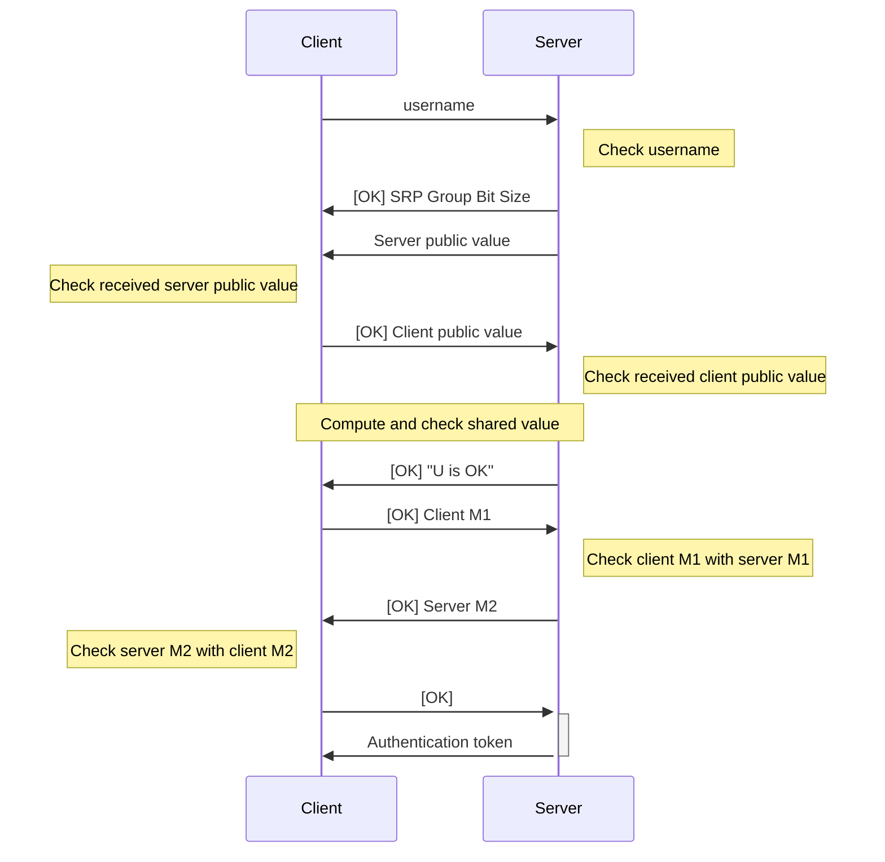

# SRP

```mermaid
sequenceDiagram
    participant C as Client
    participant S as Server

    C->>S: username
    Note right of S: Check username
    S->>C: [OK] SRP Group Bit Size
    S->>C: Server public value
    Note left of C: Check received server public value
    C->>S: [OK] Client public value
    Note right of S: Check received client public value
    Note over C,S: Compute and check shared value
    S->>C: [OK] "U is OK"
    C->>S: [OK] Client M1
    Note right of S: Check client M1 with server M1
    S->>C: [OK] Server M2
    Note left of C: Check server M2 with client M2
    C->>+S: [OK]
    activate S
    S->>-C: Authentication token
```
